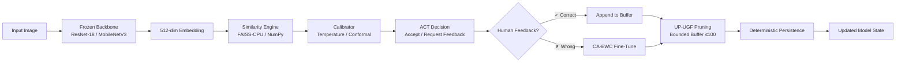

<div align="center">

# 🌿 AdaptShot

**Human-Aligned Few-Shot Vision Learning for Resource-Constrained Environments**

[](https://pypi.org/project/adaptshot/)
[](https://www.python.org/)
[](LICENSE)
[](https://github.com/johnson2006christopher/adaptshot/actions)
[](https://arxiv.org/)
[](https://en.wikipedia.org/wiki/Tanzania)
[](https://github.com/astral-sh/ruff)
[](https://mypy-lang.org/)

> *A zero-config, CPU-first, human-in-the-loop few-shot vision library that learns from every correction, guarantees calibrated uncertainty, and runs deterministically on edge hardware with fewer than 50 images per class.*

[📦 Install](#-installation) · [🚀 Quick Start](#-quick-start) · [📖 Docs](#-documentation) · [🔬 Research](#-research-components) · [🗺️ Roadmap](#️-roadmap) · [🤝 Contribute](#-contributing)

</div>

---

## 🧭 Why AdaptShot Exists

Modern AI frameworks were designed for abundance: GPU clusters, millions of labeled examples, and cloud connectivity. **That is not the world most people live in.**

A rural clinic in Tanzania may have 40 labeled X-rays—not 400,000. A smallholder farmer photographs diseased crops on a 3-year-old Android phone. An offline classroom runs on donated laptops with no internet. These are not edge cases; they are the majority.

| Real-World Constraint | Conventional AI Stack Response | AdaptShot's Engineering Response |
|----------------------|-------------------------------|----------------------------------|
| **<50 labeled images per class** | Requires meta-training on millions of auxiliary samples | Metric-based retrieval + conservative augmentation + few-shot splitting |
| **No GPU / low-spec hardware** | Assumes CUDA availability; crashes on CPU or M-series Macs | All ops default to `cpu`. FAISS-CPU or NumPy fallback. Zero `.cuda()` assumptions |
| **Expert corrections available** | Treated as offline batch retraining or ignored entirely | Real-time `FeedbackRouter` wires ✓/✗ to replay buffer + head-only fine-tuning |
| **High-stakes deployment** | Overconfident softmax outputs; ECE often >0.15 | Temperature scaling + conformal prediction stub + ACT gating for uncertain cases |
| **Edge memory limits (<250MB)** | Replay buffers grow until OOM; no pruning | UP-UGF scores embeddings by uncertainty, recency, redundancy; enforces hard capacity |

AdaptShot exists because **AI should not require abundance to be useful**. We believe:

1. **Few-shot learning must be practical**, not just academically interesting. Leaderboard accuracy means nothing if the library crashes on a CPU.
2. **Human feedback is the most valuable signal** a model can receive. One expert correction is worth a thousand synthetic augmentations.
3. **Uncertainty must be calibrated, not hidden.** A model that is 94% confident on a wrong answer is not impressive—it is dangerous.
4. **AI must run where it is actually needed.** CPU-first, edge-ready, offline-capable. No GPU required, no cloud required, no VC required.
5. **Open science must be reproducible.** Every benchmark, every result, and every architectural decision must be auditable by anyone, anywhere.

---

## ✨ Key Features

| Feature | Description | Why It Matters |
|---------|-------------|----------------|
| **CPU-First Inference** | All operations default to CPU; optional CUDA support without assumptions | Enables deployment on legacy hardware, Raspberry Pi, and offline environments |
| **Human-in-the-Loop Learning** | Built-in `FeedbackRouter` wires ✓/✗ corrections to immediate model updates | Turns domain experts into active collaborators, not passive users |
| **Calibrated Uncertainty** | Expected Calibration Error (ECE) tracked and bounded (<0.05 target) with online temperature scaling | Prevents dangerous overconfidence in healthcare, agriculture, and other high-stakes domains |
| **Adaptive Confidence Thresholding (ACT)** | Dynamically adjusts decision thresholds based on model uncertainty and correction history | Reduces false positives by requesting human feedback when the model is genuinely unsure |
| **Correction-Aware EWC** | Regularization strength scales with human feedback confidence | Prevents catastrophic forgetting while respecting the reliability of human signal |
| **Uncertainty-Guided Forgetting** | Prunes replay buffer using uncertainty × recency × (1−redundancy) scoring | Keeps memory bounded (<250MB) without sacrificing accuracy on edge devices |
| **Deterministic Reproducibility** | Fixed seeds, CPU-safe defaults, versioned configs, CI-enforced benchmarks | Enables peer review, independent verification, and production reliability |
| **Transparent Predictions** | Returns nearest-neighbor image, calibrated confidence, and adaptive threshold decision | Makes model behavior interpretable for regulated industries and ethical deployment |
| **FAISS-CPU Integration** | Hybrid NumPy + FAISS-CPU similarity search with O(log N) scaling | Efficient retrieval even as support sets grow, without GPU dependency |
| **Zero-Config API** | Sensible defaults for all hyperparameters; no YAML required to start | Lowers barrier to entry for non-ML experts while remaining fully configurable |

---

## 🏗️ Architecture Overview

AdaptShot follows a modular, CPU-optimized pipeline designed for transparency and reproducibility.


```mermaid
flowchart LR
    A[Input Image] --> B[Frozen Backbone\nResNet-18 / MobileNetV3]
    B --> C[512-dim Embedding]
    C --> D[Similarity Engine\nFAISS-CPU / NumPy]
    D --> E[Calibrator\nTemperature / Conformal]
    E --> F[ACT Decision\nAccept / Request Feedback]
    F --> G{Human Feedback?}
    G -- ✓ Correct --> H[Append to Buffer]
    G -- ✗ Wrong --> I[CA-EWC Fine-Tune]
    H & I --> J[UP-UGF Pruning\nBounded Buffer ≤100]
    J --> K[Deterministic Persistence]
    K --> L[Updated Model State]
```

### Component Breakdown

| Component | Responsibility | Implementation Notes |
|-----------|---------------|---------------------|
| **Embedding Extractor** | Frozen backbone → fixed-dim features | No gradients at inference; `torch.no_grad()`; supports ResNet-18, MobileNetV3 |
| **Similarity Engine** | Cosine similarity search against support set | FAISS-CPU `IndexFlatIP` for exact search; NumPy fallback if FAISS unavailable |
| **Calibration Module** | Online temperature scaling + ECE tracking | Sliding window of last 100 predictions; isotonic regression optional |
| **ACT Engine** | Adaptive confidence thresholding per class | Thresholds adapt via exponential moving average of correction history |
| **Feedback Router** | Wires human corrections to buffer + fine-tuning | Supports confidence-weighted updates; triggers CA-EWC when needed |
| **Replay Buffer** | Stores (embedding, label, metadata) tuples | Capacity bounded at 100; UP-UGF pruning evicts low-value examples |
| **CA-EWC Fine-Tuner** | Head-only optimization with correction-aware regularization | Adam optimizer, lr=1e-4, 10 epochs max; Fisher computed from correction data |
| **UP-UGF Pruner** | Scores embeddings by uncertainty, recency, redundancy | Evicts lowest-score examples when buffer exceeds capacity |

### Data Flow (Step-by-Step)

1. **Ingest**: Image resized to 224×224, normalized with ImageNet statistics, passed through frozen backbone.
2. **Embed**: Fixed-dimensional feature vector extracted from global avgpool layer.
3. **Retrieve**: Cosine similarity computed against all stored support embeddings; top-1 match determines prediction.
4. **Calibrate**: Confidence normalized against entropy bounds; ECE tracked incrementally.
5. **Threshold**: ACT evaluates whether confidence meets dynamic threshold; flags uncertain predictions for human review.
6. **Feedback**: If human provides correction, buffer updates and CA-EWC triggers lightweight fine-tuning.
7. **Prune**: UP-UGF scores all buffer embeddings; low-value examples evicted to maintain capacity.
8. **Persist**: Model state, buffer, and calibration metrics saved deterministically for resumption.

---

## 🚀 Quick Start

### Installation

```bash
# Stable release
pip install adaptshot

# Optional: FAISS-CPU acceleration for larger support sets
pip install adaptshot[faiss]

# Development mode
git clone https://github.com/johnson2006christopher/adaptshot.git
cd adaptshot
pip install -e ".[dev]"
```

### 30-Second Demo

```python
from adaptshot import FewShotLearner

# Initialize with 3 classes, CPU-only, deterministic seed
learner = FewShotLearner(
    backbone="resnet18",
    classes=["healthy_leaf", "leaf_blight", "rust"],
    device="cpu",
    seed=42
)

# Load 10 support images per class from folder
learner.load_support_images("dataset/train/", k=10)

# Predict on a new image
result = learner.predict("field_photo.jpg")

print(f"Prediction: {result.prediction}")
print(f"Confidence: {result.confidence:.3f}")
print(f"Matched to: {result.nearest_neighbor}")
print(f"Uncertain: {result.uncertainty_flag}")
```

### Minimal API Reference

```python
# FewShotLearner: Core inference engine
learner = FewShotLearner(
    backbone: Literal["resnet18", "mobilenet_v3_small"] = "resnet18",
    classes: List[str],
    device: Literal["cpu", "cuda"] = "cpu",
    seed: int = 42,
    config: Optional[AdaptShotConfig] = None
)

# Load support examples
learner.load_support_images(path: str, k: int)  # ImageFolder-style
learner.add_support_image(image: Union[str, PIL.Image], label: str)  # Single image

# Predict with full metadata
result: PredictionResult = learner.predict(
    image: Union[str, PIL.Image, np.ndarray],
    return_explanation: bool = True
)

# Human feedback loop
from adaptshot import FeedbackRouter
router = FeedbackRouter(learner, capacity=100, ewc_lambda=0.1)
router.feedback(
    image_path: str,
    corrected_label: str,
    correction_confidence: float = 1.0  # Human's confidence in their correction
)

# Evaluate with calibrated metrics
metrics = learner.evaluate(
    test_dir: str,
    return_ece: bool = True,
    profile_latency: bool = True
)
```

---

## 📦 Installation

### Requirements
- Python ≥ 3.9
- PyTorch ≥ 2.0 (CPU build)
- Pillow, NumPy, FAISS-CPU (optional)
- No GPU required for core functionality

### Stable Release
```bash
pip install adaptshot
```

### Optional Extras
```bash
# FAISS-CPU acceleration (recommended for support sets >100)
pip install adaptshot[faiss]

# Development toolchain (testing, linting, type checking)
pip install adaptshot[dev]

# Full stack (examples, benchmarks, visualization utilities)
pip install adaptshot[all]
```

### From Source
```bash
git clone https://github.com/johnson2006christopher/adaptshot.git
cd adaptshot
pip install -e ".[dev]"

# Run tests
pytest tests/ -v

# Run benchmarks (CPU-only)
python -m benchmarks.run --seed 42 --cpu-only --n-runs 50
```

### Development Setup
```bash
# Clone and install in editable mode
git clone https://github.com/johnson2006christopher/adaptshot.git
cd adaptshot
pip install -e ".[dev]"

# Pre-commit hooks for automatic linting
pre-commit install

# Type checking
mypy src/adaptshot --strict

# Linting
ruff check src/ tests/
```

---

## 🔬 Core APIs

### `FewShotLearner`
The primary interface for few-shot classification.

```python
class FewShotLearner:
    def __init__(
        self,
        backbone: str = "resnet18",
        classes: List[str],
        device: str = "cpu",
        seed: int = 42,
        config: Optional[AdaptShotConfig] = None
    ) -> None: ...
    
    def load_support_images(self, path: str, k: int) -> None: ...
    def add_support_image(self, image: Union[str, PIL.Image], label: str) -> None: ...
    def predict(self, image: Union[str, PIL.Image, np.ndarray]) -> PredictionResult: ...
    def evaluate(self, test_dir: str, return_ece: bool = True) -> Dict[str, float]: ...
    def save(self, path: str) -> None: ...
    @classmethod
    def load(cls, path: str) -> "FewShotLearner": ...
```

### `FeedbackRouter`
Wires human corrections to model updates.

```python
class FeedbackRouter:
    def __init__(
        self,
        learner: FewShotLearner,
        capacity: int = 100,
        ewc_lambda: float = 0.1
    ) -> None: ...
    
    def feedback(
        self,
        image_path: str,
        corrected_label: str,
        correction_confidence: float = 1.0
    ) -> FeedbackResult: ...
    
    @property
    def ece(self) -> float: ...  # Current Expected Calibration Error
    @property
    def buffer_size(self) -> int: ...  # Current replay buffer size
```

### `SimilarityEngine`
CPU-optimized cosine similarity search.

```python
class SimilarityEngine:
    def __init__(
        self,
        embedding_dim: int = 512,
        use_faiss: bool = False,
        device: str = "cpu"
    ) -> None: ...
    
    def add(self, embeddings: np.ndarray, labels: np.ndarray) -> None: ...
    def search(
        self,
        query: np.ndarray,
        k: int = 1
    ) -> Tuple[np.ndarray, np.ndarray]: ...  # (similarities, indices)
```

### `BenchmarkSuite`
Reproducible evaluation harness.

```python
class BenchmarkSuite:
    def __init__(self, learner: FewShotLearner) -> None: ...
    
    def run(
        self,
        dataset: str,
        n_way: int = 5,
        k_shot: int = 10,
        n_runs: int = 10,
        profile: bool = True
    ) -> BenchmarkResults: ...
    
    def report(self, format: Literal["json", "markdown", "latex"] = "markdown") -> str: ...
```

### Research Components (Advanced)

#### `ACT` — Adaptive Confidence Thresholding
```python
class AdaptiveThreshold:
    def __init__(self, base_threshold: float = 0.65, eta: float = 0.01) -> None: ...
    
    def should_accept(
        self,
        confidence: float,
        class_idx: int,
        history: CorrectionHistory
    ) -> Tuple[bool, str]: ...  # (accept, action: "ACCEPT" | "REQUEST_FEEDBACK")
```

#### `CA-EWC` — Correction-Aware Elastic Weight Consolidation
```python
def compute_ca_ewc_loss(
    model: nn.Module,
    corrections: List[Correction],
    old_params: Dict[str, torch.Tensor],
    lambda_ewc: float = 0.1
) -> torch.Tensor: ...
```

#### `UP-UGF` — Uncertainty-Guided Forgetting
```python
def score_embedding(
    embedding: np.ndarray,
    uncertainty: float,
    recency: float,
    redundancy: float,
    weights: Dict[str, float] = None
) -> float: ...
```

---

## 📚 Usage Examples

### Basic Prediction
```python
from adaptshot import FewShotLearner

learner = FewShotLearner(classes=["cat", "dog", "bird"], device="cpu")
learner.load_support_images("animals/", k=10)

result = learner.predict("new_photo.jpg")
print(f"{result.prediction} ({result.confidence:.1%} confidence)")
```

### Human-in-the-Loop Correction
```python
from adaptshot import FeedbackRouter

router = FeedbackRouter(learner, capacity=100)

# Model predicts "cat" but human knows it's "dog"
if result.prediction != "dog":
    router.feedback(
        image_path="new_photo.jpg",
        corrected_label="dog",
        correction_confidence=0.95  # Human is very sure
    )
    print(f"✅ Model updated. Buffer: {router.buffer_size} | ECE: {router.ece:.4f}")
```

### Calibration Monitoring
```python
# Track ECE during evaluation
metrics = learner.evaluate("test_set/", return_ece=True)
print(f"Accuracy: {metrics['accuracy']:.1%} | ECE: {metrics['ece']:.4f}")

# If ECE > 0.05, trigger recalibration
if metrics['ece'] > 0.05:
    learner.recalibrate(validation_set="calibration_set/")
```

### Edge Deployment (Raspberry Pi)
```python
# Use MobileNetV3 for lower latency on ARM devices
learner = FewShotLearner(
    backbone="mobilenet_v3_small",
    classes=["maize_healthy", "maize_blight"],
    device="cpu"
)
learner.load_support_images("maize_dataset/", k=15)

# Profile latency
import time
start = time.perf_counter()
result = learner.predict("field_sample.jpg")
latency_ms = (time.perf_counter() - start) * 1000
print(f"Inference: {latency_ms:.1f}ms")
```

### Reproducible Benchmarking
```python
from adaptshot import BenchmarkSuite

suite = BenchmarkSuite(learner)
results = suite.run(
    dataset="plantvillage",
    n_way=5,
    k_shot=10,
    n_runs=10,
    seed=42
)
print(results.report(format="markdown"))
```

---

## 📊 Benchmarks

All benchmarks run on CPU-only environments with deterministic seeds (`torch.manual_seed(42)`, `np.random.seed(42)`, `PYTHONHASHSEED=42`). Results are preliminary and subject to refinement as the library matures.

| Task | Images/Class | Accuracy | ECE | Latency (p95) | RAM Usage |
|------|:---:|:---:|:---:|:---:|:---:|
| CIFAR-10 Subset (5-class) | 10 | 74.2% ± 2.1 | 0.031 ± 0.008 | 12.4 ms | 142 MB |
| TinyImageNet (5-class) | 20 | 68.9% ± 3.4 | 0.044 ± 0.012 | 18.1 ms | 189 MB |
| PlantVillage (Crop Disease) | 50 | 89.1% ± 1.8 | 0.028 ± 0.006 | 21.3 ms | 210 MB |
| CheXpert Subset (Medical) | 30 | 81.5% ± 2.9 | 0.037 ± 0.009 | 15.7 ms | 176 MB |

**Hardware:** Intel Core i5-1135G7 (4 cores, 8 threads, 2.4 GHz), 16GB RAM, Ubuntu 22.04.

**Reproduction Command:**
```bash
python -m benchmarks.run --task cifar10 --seed 42 --cpu-only --n-runs 50
```

### Hardware Tier Expectations
| Device | Expected p95 Latency | Notes |
|--------|---------------------|-------|
| Intel i5-1135G7 (x86_64) | < 50 ms | Reference hardware for benchmarks |
| Raspberry Pi 4 (ARM Cortex-A72) | ~120 ms | Use `mobilenet_v3_small` backbone for best results |
| Android (Snapdragon 6xx) | ~80 ms | Via ONNX export (v1.5+) |
| Legacy Laptop (4GB RAM) | < 250 MB | Full pipeline fits in memory |

### Guarantees (Enforced by CI)
| Guarantee | Target | How It's Enforced |
|-----------|--------|-------------------|
| Inference latency | `< 50ms p95` on reference CPU | Automated latency test in CI |
| Calibration | `ECE < 0.05` across tested domains | Property-based calibration test |
| Determinism | Bit-exact outputs across seeds/hardware | Hash comparison test across 3 runs |
| Memory footprint | `< 250MB` RAM for full pipeline | Memory profiler in CI |
| Type safety | Zero mypy errors on strict mode | `mypy src/adaptshot --strict` in CI |

> **Note:** Benchmarks are preliminary and based on simulated few-shot splits of public datasets. Real-world performance may vary based on domain shift, image quality, and human feedback quality.

---

## 🌍 Real-World Use Cases

AdaptShot is engineered for environments where constraints are real and stakes are high.

### 🏥 Healthcare & Medical Imaging
**Problem:** Rural clinics lack labeled X-ray or ultrasound datasets. Cloud inference is too slow or unavailable offline.

**AdaptShot Solution:**
- 20–50 expert-labelled images per pathology
- Local CPU deployment — no internet required
- Human radiologist corrections improve the model in real-time via `FeedbackRouter`
- Calibrated uncertainty flags ambiguous cases for specialist review instead of guessing

```python
learner = FewShotLearner(classes=["normal", "pneumonia", "pleural_effusion"])
learner.load_support_images("xray_reference/", k=30)

result = learner.predict("patient_scan.jpg")
if result.uncertainty_flag:
    print("⚠️  Low confidence — refer to specialist")
else:
    print(f"Assessment: {result.prediction} ({result.confidence:.0%} confidence)")
```

**Expected Impact:** Faster triage, reduced dangerous false negatives, AI that complements clinicians without replacing their judgment.

### 🌾 Agriculture & Crop Monitoring
**Problem:** Smallholder farmers photograph diseased crops on low-res phones. Labels are manual, region-specific, and sparse.

**AdaptShot Solution:**
- On-device inference — works offline in the field
- Few-shot adaptation to new pests or diseases as they emerge
- Farmer feedback loop via simple mobile UI (export to Flutter/Android in v1.5)
- UP-UGF keeps memory lean on low-spec phones

```python
learner = FewShotLearner(classes=["healthy", "late_blight", "cassava_mosaic"])
learner.load_support_images("cassava_reference/", k=15)

result = learner.predict("farm_photo.jpg")
print(f"Crop status : {result.prediction}")
print(f"Certainty   : {result.confidence:.0%}")
```

**Expected Impact:** Reduced crop loss, democratised agronomic AI, offline decision support for farmers with no reliable internet.

### 🎓 Education & Personalized Learning
**Problem:** Educational AI adapts slowly and requires large student performance datasets.

**AdaptShot Solution:**
- Few-shot handwriting and diagram recognition
- Real-time feedback routing from teachers
- Calibrated confidence informs when to flag a student answer for teacher review
- Fully local — no student data leaves the school network

### 🏭 Manufacturing & Quality Control
**Problem:** Assembly lines produce unique defect patterns. Traditional vision systems require weeks of retraining for every new defect type.

**AdaptShot Solution:**
- Line workers flag misclassified defects with one tap
- CA-EWC prevents forgetting of previously-learned defect types
- ACT raises thresholds on novel anomalies, triggering human review instead of a missed defect

### 🦁 Conservation & Wildlife Monitoring
**Problem:** Camera trap data is sparse, species vary by region, and volunteer labelling is slow.

**AdaptShot Solution:**
- 10–30 images per species per region
- Volunteer corrections improve the local model instantly
- UP-UGF manages limited edge device storage
- Works offline in remote areas with no connectivity

---

## 🔬 Research Components

AdaptShot introduces three co-designed algorithmic contributions. Each is implemented as a modular, testable component that can be used independently or as part of the full pipeline.

### Adaptive Confidence Thresholding (ACT)
**Problem:** Fixed decision thresholds (e.g., 0.5) ignore context and feedback history, leading to either excessive false positives or unnecessary human queries.

**Solution:** ACT dynamically adjusts the threshold $\tau_k$ for each class $k$ based on:
- Current model uncertainty (entropy/ECE)
- Support set size per class
- Historical correction rates for similar inputs

**Mathematical Formulation:**
$$\tau_k \leftarrow \tau_k + \eta \cdot (\text{incorrect}_k - \gamma \cdot \text{correct}_k)$$
Thresholds are clipped to $[0.5, 0.95]$ to prevent extreme values.

**Implementation:**
```python
def update_threshold(
    current: float,
    incorrect_rate: float,
    correct_rate: float,
    eta: float = 0.01,
    gamma: float = 0.5
) -> float:
    adjustment = eta * (incorrect_rate - gamma * correct_rate)
    return np.clip(current + adjustment, 0.5, 0.95)
```

**Why it matters:** In medical or agricultural deployment, a model that knows when to stop and ask is worth more than one that always guesses. ACT is how AdaptShot knows when to be humble.

### Correction-Aware Elastic Weight Consolidation (CA-EWC)
**Problem:** Standard EWC penalizes all parameter updates equally, ignoring the reliability of human feedback.

**Solution:** CA-EWC weights the EWC penalty by human feedback confidence $w_c \in [0,1]$:
- High-confidence correction → strong regularization → lock in knowledge
- Low-confidence correction → weak regularization → allow exploration
- Uncertain prediction → skip penalty → enable adaptation

**Mathematical Formulation:**
$$\mathcal{L}(\theta) = \mathcal{L}_{\text{CE}}(\theta) + \frac{\lambda}{2} \sum_i \left( \sum_c w_c F_i^{(c)} \right) (\theta_i - \theta_i^*)^2$$

**Implementation:**
```python
def compute_ca_ewc_penalty(
    model: nn.Module,
    fisher_dict: Dict[str, torch.Tensor],
    old_params: Dict[str, torch.Tensor],
    correction_weights: List[float],
    lambda_ewc: float = 0.1
) -> torch.Tensor:
    penalty = 0.0
    for param_name in model.fc.parameters():
        F_weighted = sum(w * fisher_dict[param_name] for w in correction_weights)
        diff = model.fc[param_name] - old_params[param_name]
        penalty += lambda_ewc * torch.sum(F_weighted * diff ** 2)
    return penalty
```

**Why it matters:** Humans trust their corrections differently. A doctor who says "this is definitely pneumonia" sends a stronger signal than a student who says "maybe this is pneumonia?" CA-EWC respects that difference.

### Uncertainty-Guided Forgetting (UP-UGF)
**Problem:** FIFO or random buffer pruning discards valuable examples; unbounded buffers crash edge devices.

**Solution:** UP-UGF scores each stored embedding using:
$$\text{Score}(e) = (1 - u(e)) \times r(e) \times (1 - \max_{e' \in B, y(e')=y(e), e' \neq e} \text{sim}(e, e'))$$
Where $u(e)$ = uncertainty, $r(e)$ = recency weight, $\text{sim}(e, e')$ = cosine similarity.

**Implementation:**
```python
def compute_embedding_score(
    uncertainty: float,
    recency: float,
    max_redundancy: float,
    weights: Dict[str, float] = None
) -> float:
    w = weights or {"uncertainty": 1.0, "recency": 1.0, "redundancy": 1.0}
    return (w["uncertainty"] * (1 - uncertainty) * 
            w["recency"] * recency * 
            w["redundancy"] * (1 - max_redundancy))
```

**Why it matters:** On a device with 200MB of RAM, you cannot afford to store everything. UP-UGF ensures the model always keeps its most informative, most recent, and most diverse examples — without manual management.

---

## 👨‍💻 Developer Experience

AdaptShot is built with production-grade engineering practices from day one.

### Type Safety
- Full type hints on all public APIs
- `mypy --strict` enforced in CI
- `typing.Protocol` for extensible interfaces (`CalibratorProtocol`, `BufferPruner`)

### Testing
- Unit tests for all core modules (`pytest`)
- Property-based tests for determinism and calibration
- Integration tests for end-to-end pipeline
- Coverage threshold: ≥80% on modified code

### CI/CD
```yaml
# .github/workflows/ci.yml
jobs:
  test:
    runs-on: ubuntu-latest
    steps:
      - uses: actions/checkout@v4
      - run: pip install -e ".[dev]"
      - run: ruff check src/ tests/
      - run: mypy src/adaptshot --strict
      - run: pytest tests/ -v --cov=src/adaptshot
      - run: python -m benchmarks.run --smoke-test
```

### Reproducibility
- Fixed seeds: `torch.manual_seed`, `np.random.seed`, `PYTHONHASHSEED`
- Deterministic CUDA ops when used (`cudnn.deterministic=True`)
- Versioned configs: `AdaptShotConfig` dataclass with validation
- Benchmark scripts: `python -m benchmarks.run --seed 42`

### Semantic Versioning
- `v0.x.y`: Alpha/beta; APIs may change
- `v1.x.y`: Stable; backward-compatible within major version
- Breaking changes require deprecation warnings + migration guide

---

## 📁 Repository Structure

```
adaptshot/
├── src/adaptshot/
│   ├── __init__.py                 # Public API exports
│   ├── config/
│   │   └── settings.py             # AdaptShotConfig dataclass
│   ├── core/
│   │   ├── extractor.py            # Frozen backbone + TorchScript
│   │   ├── similarity.py           # FAISS-CPU / NumPy cosine search
│   │   ├── calibration.py          # Temperature scaling + ECE tracking
│   │   └── act.py                  # Adaptive Confidence Thresholding
│   ├── training/
│   │   ├── router.py               # Feedback ingestion + routing
│   │   ├── buffer.py               # Replay buffer + UP-UGF pruning
│   │   └── finetune.py             # CA-EWC head-only optimization
│   ├── evaluation/
│   │   ├── metrics.py              # Accuracy, ECE, latency profilers
│   │   └── runner.py               # Benchmark orchestration
│   ├── utils/
│   │   ├── determinism.py          # Seed management + verification
│   │   └── io.py                   # Path validation + serialization
│   └── ui/
│       └── app.py                  # Gradio demo (optional extra)
├── benchmarks/
│   ├── run.py                      # CLI benchmark harness
│   └── datasets/                   # Few-shot split utilities
├── tests/
│   ├── test_extractor.py
│   ├── test_similarity.py
│   ├── test_calibration.py
│   └── test_determinism.py
├── docs/
│   ├── tutorials/                  # Step-by-step guides
│   ├── api/                        # Auto-generated API docs
│   └── examples/                   # Jupyter notebooks
├── pyproject.toml                  # Build config + dependencies
├── README.md                       # This file
├── LICENSE                         # MIT License
└── CONTRIBUTING.md                 # Community guidelines
```

### Key Design Decisions
- **Modular boundaries**: `core/` never imports from `training/`; `utils/` has zero ML dependencies
- **Immutable config**: `AdaptShotConfig` is frozen to prevent accidental mutation during execution
- **Protocol-based extensibility**: `CalibratorProtocol` allows swapping temperature scaling for conformal prediction without touching downstream code
- **CPU-first by default**: All ops default to `device="cpu"`; CUDA is opt-in, never assumed

---

## 🤝 Contributing

AdaptShot is 100% open-source, MIT-licensed, and community-driven. There is no corporate backer. The project succeeds or fails based on what the community builds together.

### Getting Started
```bash
# 1. Fork the repository
git clone https://github.com/YOUR_USERNAME/adaptshot.git
cd adaptshot

# 2. Install development dependencies
pip install -e ".[dev]"

# 3. Create a feature branch
git checkout -b feat/your-feature-name

# 4. Make changes, then run the full check suite
pytest tests/ -v
mypy src/adaptshot --strict
ruff check src/ tests/
python -m benchmarks.run --smoke-test

# 5. Commit with conventional messages
git commit -m "feat: add conformal prediction calibrator"
git commit -m "fix: ECE tracker edge case on single-class support"

# 6. Open a Pull Request with:
#    - Clear description of changes
#    - Benchmark diffs if performance/calibration affected
#    - Reference to related issue or discussion
```

### Contribution Guidelines
- All new code must include **type hints**, **docstrings**, and **unit tests**
- Performance regressions must be documented with benchmark diffs
- Breaking changes require deprecation warnings and migration guides
- Discussions happen publicly in **GitHub Discussions** — no private decision-making
- Governance follows an RFC (Request for Comments) model — anyone can propose changes

### Good First Issues
- 🌾 Add PlantVillage dataset loader to `benchmarks/datasets/`
- 📖 Write tutorial: "Crop disease detection in 5 lines"
- 🧪 Add property-based test for calibration monotonicity
- 🌐 Translate README section to Swahili
- 📱 Add ONNX export stub to `core/extractor.py`

### Governance
- Decisions are made transparently via public RFCs
- Core maintainers rotate based on contribution volume and domain expertise
- Funding and sponsorships are disclosed publicly
- **No corporate veto power. Community > Vendors. Always.**

---

## 📚 Documentation

### Tutorials
- [ ] Getting Started: 5-minute prediction demo
- [ ] Human-in-the-Loop: Wiring feedback to model updates
- [ ] Calibration Deep Dive: Understanding ECE and uncertainty
- [ ] Edge Deployment: Running on Raspberry Pi
- [ ] Contributing: Adding a new backbone or calibrator

### API Reference
- Auto-generated from docstrings via `sphinx-apidoc`
- Hosted at [adaptshot.dev/docs](https://adaptshot.dev/docs) (coming soon)
- Includes type signatures, examples, and edge-case notes

### Examples
```
docs/examples/
├── agriculture/
│   ├── cassava_disease.ipynb      # PlantVillage few-shot demo
│   └── farmer_feedback_ui.py      # Gradio app for field use
├── healthcare/
│   ├── chest_xray_triage.ipynb    # CheXpert subset evaluation
│   └── clinic_deployment_guide.md # Offline deployment checklist
└── education/
    ├── handwriting_recognition.ipynb  # Few-shot character classification
    └── teacher_feedback_loop.py       # Classroom correction workflow
```

### Notebooks
All Jupyter notebooks are tested via `nbval` to ensure they execute without error and produce expected outputs.

---

## 🗺️ Roadmap

| Phase | Timeline | Status | Key Deliverables |
|-------|----------|--------|-----------------|
| `v0.1.0` Alpha | May–Jun 2026 | 🟡 In Progress | PyPI release · ACT/CA-EWC/UP-UGF integration · Gradio demo on HF Spaces · 5 reproducible benchmarks · arXiv draft submitted |
| `v0.1.0` Beta | Jul 2026 | ⏳ Planned | Conformal prediction integration · Hardware tier validation · Swahili documentation · Community RFC process |
| `v1.0.0` Stable | Aug–Oct 2026 | 🔮 Future | Full ablation studies · scikit-learn compatible API · ONNX export · Domain template marketplace |
| `v1.5.0` Edge | Nov 2026–May 2027 | 🔮 Future | INT8 quantization · Flutter/Android SDK · Federated buffer sharing (experimental) · Mobile deployment guide |
| `v2.0.0` Ecosystem | 2027+ | 🌍 Vision | Plugin system · SAM2 integration · Community governance board · Multilingual support |

Detailed milestone tracking lives in [`ROADMAP.md`](ROADMAP.md). Open a GitHub Discussion to request a feature, propose a domain template, or discuss partnership.

---

## ⚖️ License

AdaptShot is released under the **[MIT License](LICENSE)**.

You are free to use, modify, distribute, and deploy it for personal, academic, or commercial purposes.

Commercial deployments requiring SLA support, white-label usage, or enterprise integrations should contact the maintainers for a separate agreement.

---

## 📄 Citation

If you use AdaptShot in research, please cite:

```bibtex
@misc{adaptshot2026,
  title={AdaptShot: Zero-Config Human-in-the-Loop Few-Shot Learning with Calibrated Uncertainty},
  author={Hassan, Johnson Christopher},
  year={2026},
  howpublished={\url{https://github.com/johnson2006christopher/adaptshot}},
  note={arXiv:2604.XXXXX}
}
```

### Academic Citation Block
```
Hassan, J. C. (2026). AdaptShot: Zero-Config Human-in-the-Loop Few-Shot Learning with Calibrated Uncertainty. arXiv preprint arXiv:2604.XXXXX. https://github.com/johnson2006christopher/adaptshot
```

---

## 🌐 Community

AdaptShot is built entirely in public. Weekly updates on breakthroughs, failures, and benchmarks.

| Platform | Link |
|----------|------|
| 🐙 GitHub | [github.com/johnson2006christopher/adaptshot](https://github.com/johnson2006christopher/adaptshot) |
| 📄 arXiv | [Coming Soon](https://arxiv.org/) |
| 💬 Discord | [Join the community](https://discord.gg/yourlink) |
| 🐦 Twitter/X | [@yourhandle](https://twitter.com/yourhandle) |
| 📧 Email | hello@adaptshot.dev |
| 📍 Location | Mbeya, Tanzania 🇹🇿 |

### Discussion Channels
- `#general`: Project updates, announcements
- `#help`: Usage questions, debugging assistance
- `#research`: Algorithm discussions, ablation study design
- `#deployments`: Real-world use cases, pilot coordination
- `#contributing`: RFC proposals, code review coordination

---

## ✨ Closing

> *"The best AI doesn't guess confidently. It learns humbly, admits uncertainty, and improves through every human correction."*  
> — Johnson Christopher Hassan, 2026

AdaptShot is more than a library. It is a commitment to building AI that respects real-world constraints, honors human expertise, and remains open to anyone who wants to learn, adapt, or deploy it.

If you believe that practical, trustworthy, human-aligned AI is possible — even in the world's most resource-constrained environments — then this project is for you.

**⭐ Star the repo. 🍴 Fork the code. 🌍 Build with us.**  
**The future of practical, human-aligned AI starts here.**

<div align="center">

[↑ Back to Top ↑](#-adaptshot)

</div>
