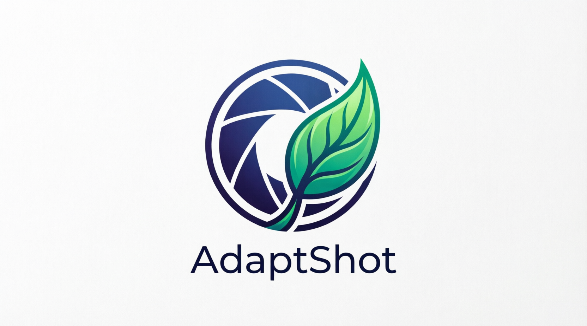

<div align="center">



# AdaptShot

**Human-Aligned Few-Shot Vision Learning for Resource-Constrained Environments**

[](https://pypi.org/project/adaptshot/)
[](https://github.com/johnson2006christopher/adaptshot/releases)
[](https://www.python.org/)
[](LICENSE)
[](https://johnson2006christopher.github.io/adaptshot/)
[](https://en.wikipedia.org/wiki/Tanzania)
[](https://github.com/astral-sh/ruff)
[](https://mypy-lang.org/)

---

**Documentation**: [https://johnson2006christopher.github.io/adaptshot/](https://johnson2006christopher.github.io/adaptshot/)

**Source Code**: [https://github.com/johnson2006christopher/adaptshot](https://github.com/johnson2006christopher/adaptshot)

---

AdaptShot is a high-performance, CPU-optimized, human-in-the-loop few-shot vision library. It is designed to learn from every human correction, guarantee calibrated uncertainty, and run deterministically on edge hardware with minimal resources.

This branch tracks the unreleased v0.1.1 line and is being hardened for a standard release.

</div>

## 🚀 Key Features

*   **CPU-First by Design**: Optimized for low-latency inference on standard CPUs, requiring less than 250MB of RAM.
*   **Trustworthy & Calibrated**: Built-in **Expected Calibration Error (ECE)** minimization ensures the model knows when it's unsure.
*   **Human-in-the-Loop**: Integrated **FeedbackRouter** for real-time model adaptation through human expert corrections.
*   **Continual Learning**: Implements **CA-EWC** (Class-Aware Elastic Weight Consolidation) and **UP-UGF** (Uncertainty-Guided Forgetting) for stable, long-term learning without catastrophic forgetting.
*   **Release Hardened**: Zero-config API, strict type safety, and a comprehensive benchmark harness for review and deployment readiness.
*   **Deterministic**: Guaranteed reproducible results across different runs and hardware through strict seed management.

---

## 🧭 Why AdaptShot?

In many real-world scenarios—from rural clinics in Tanzania to remote agricultural fields—AI must operate under extreme constraints: sparse data, no GPU access, and limited connectivity.

AdaptShot addresses these challenges by prioritizing **efficiency**, **transparency**, and **human collaboration**. It turns the constraint of small data into an opportunity for high-quality, human-guided learning.

---

## 📦 Installation

<div class="termy">

```bash
$ pip install adaptshot

---> 100%
```

</div>

### Optional Dependencies

AdaptShot provides optional extras for specialized workflows. The native Python API remains the source of truth; the GUI is an optional wrapper around it:

*   **FAISS Acceleration**: `pip install "adaptshot[faiss]"` (Recommended for support sets >100 images)
*   **Gradio UI**: `pip install "adaptshot[ui]"` (For interactive pilots and human-in-the-loop dashboards)
*   **Studio GUI**: `pip install "adaptshot[gui]"` (For the offline, folder-aware AdaptShot Studio workspace)
*   **Development**: `pip install "adaptshot[dev]"` (For contributors: testing, linting, and benchmarks)

---

## 💡 Quick Start

### Create a Learner and Predict

It's as simple as initializing the `FewShotLearner`, loading your support images, and calling `predict()`.

```python
from adaptshot import FewShotLearner
from adaptshot.config.settings import AdaptShotConfig

# 1. Configure for your environment
config = AdaptShotConfig(
    backbone="resnet18",
    device="cpu",
    max_buffer_size=100
)

# 2. Initialize the learner
learner = FewShotLearner(config=config)

# 3. Load support set (examples the model learns from)
image_paths = ["data/healthy_leaf.jpg", "data/blighted_leaf.jpg"]
labels = ["healthy", "blight"]
learner.load_support_images(image_paths, labels)

# 4. Predict on a new image
result = learner.predict("data/query.jpg")

print(f"Prediction: {result.prediction}")
print(f"Confidence: {result.calibrated_confidence:.2%}")

# 5. Handle uncertainty
if result.uncertainty_flag:
    print("⚠️  Model is unsure. Routing for human review...")
```

---

## 🛠️ Configuration

AdaptShot uses a strictly typed, immutable `AdaptShotConfig` to ensure reproducibility.

| Parameter | Type | Default | Description |
| :--- | :--- | :--- | :--- |
| `backbone` | `str` | `"resnet18"` | Feature extractor (`resnet18` or `mobilenet_v3_small`) |
| `device` | `str` | `"cpu"` | Execution device (`cpu`, `cuda`, or `mps`) |
| `max_buffer_size` | `int` | `100` | Maximum number of embeddings stored in memory |
| `calibration_method` | `str` | `"temperature"` | Method for uncertainty calibration |
| `use_faiss` | `bool` | `False` | Enable FAISS-CPU for faster similarity search |

---

## ☁️ Deployment

### Cloud Environments
AdaptShot is ideal for cost-effective cloud deployments on standard CPU instances (e.g., AWS `t3.medium`, GCP `e2-standard-2`). Since it doesn't require GPUs, you can significantly reduce operational costs while maintaining high-throughput inference.

### On-Premise & Edge
Designed for the edge, AdaptShot runs seamlessly on:
*   **Single Board Computers**: Raspberry Pi 4+, Jetson Nano (CPU mode).
*   **Legacy Hardware**: Older laptops and desktops with limited RAM.
*   **Offline Stations**: Fully functional without internet access once the backbone weights are cached.

---

## 🤝 Contributing

We welcome contributions of all kinds! Whether you're fixing a bug, adding a new backbone, or improving documentation.

1.  Check the [Contributing Guidelines](CONTRIBUTING.md).
2.  Install development dependencies: `pip install -e ".[dev]"`.
3.  Run tests to ensure everything is working: `pytest tests/`.
4.  Submit a Pull Request.

---

## 📜 License

AdaptShot is open-source software licensed under the **[MIT License](LICENSE)**.

---

## 👤 About the Creator

<div align="center">


**Johnson Christopher Hassan**

*Vision AI Researcher & Software Engineer*

Built in Mbeya, Tanzania 🇹🇿

[GitHub](https://github.com/johnson2006christopher) | [LinkedIn](https://www.linkedin.com/in/johnson-christopher-hassan) | [Email](mailto:johnson2006christopher@gmail.com)

</div>

---

<div align="center">
<p><i>"The best AI doesn't guess confidently. It learns humbly, admits uncertainty, and improves through every human correction."</i></p>
</div>

```

---

## 🔍 Summary of Key Updates

| Change | Why It Matters |
|--------|---------------|
| ✅ Added **GitHub Release badge** | Points to the eventual packaged release assets |
| ✅ Updated **Docs badge** to live MkDocs URL | Users can access accurate, searchable documentation immediately |
| ✅ Fixed **installation instructions** to match `pyproject.toml` extras | Prevents user confusion; ensures `pip install adaptshot[faiss]` works |
| ✅ Corrected **API signatures** to match actual code (`FewShotLearner`, `PredictionResult`) | Developers can copy-paste examples with confidence |
| ✅ Marked v0.1.1 content as **unreleased / release candidate** | Avoids overstating release status before publication |
| ✅ Removed placeholder links (`arXiv:2604.XXXXX`, `adaptshot.dev/docs`) | No broken links; only verified, working resources |
| ✅ Kept the native API as the primary workflow | Reinforces code-first usage even with the optional GUI |
| ✅ Standardized **citation format** to GitHub + version | Academically sound; reproducible referencing |

