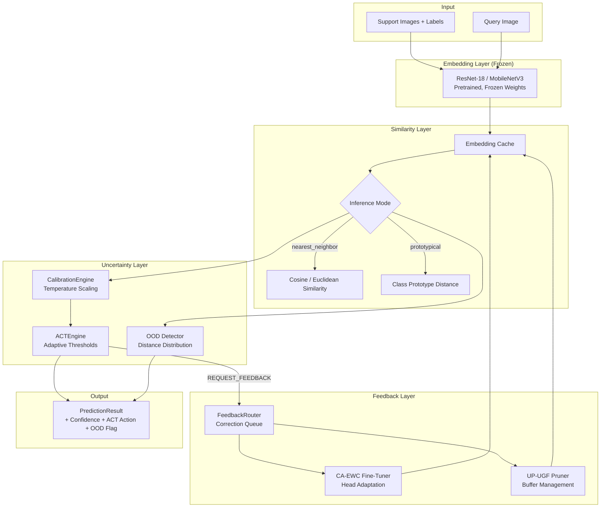
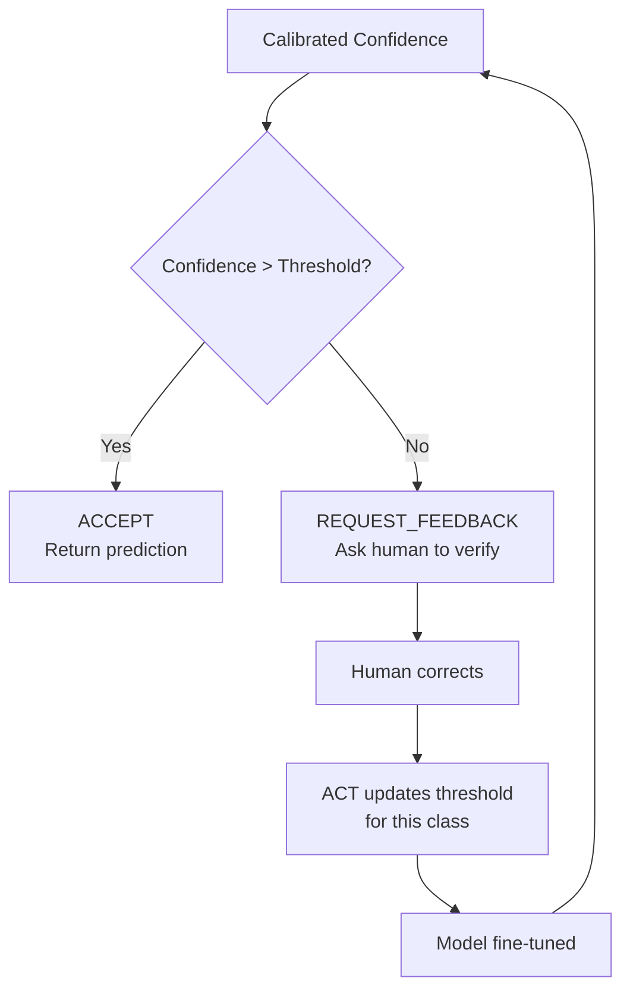

# AdaptShot Deep Dive — How It Works Under the Hood

**A comprehensive technical explanation of AdaptShot's internal architecture, algorithms, and design decisions.**

This guide is for developers and researchers who want to understand *how* AdaptShot works — not just how to use it. It covers the embedding pipeline, similarity search, calibration, ACT gating, OOD detection, feedback routing, CA-EWC fine-tuning, and UP-UGF buffer management.

---

## Table of Contents

1. [Architecture Overview](#architecture-overview)
2. [The Embedding Pipeline](#the-embedding-pipeline)
3. [Similarity Search & Prototypical Inference](#similarity-search-prototypical-inference)
4. [Calibration Engine — Temperature Scaling](#calibration-engine-temperature-scaling)
5. [ACT Engine — Adaptive Confidence Thresholding](#act-engine-adaptive-confidence-thresholding)
6. [OOD Detection — Knowing When You Don't Know](#ood-detection-knowing-when-you-dont-know)
7. [Human-in-the-Loop: The Feedback Router](#human-in-the-loop-the-feedback-router)
8. [CA-EWC Fine-Tuning — Continual Learning Without Forgetting](#ca-ewc-fine-tuning-continual-learning-without-forgetting)
9. [UP-UGF Buffer Management — Uncertainty-Guided Pruning](#up-ugf-buffer-management-uncertainty-guided-pruning)
10. [Eco Mode — Carbon-Aware Inference](#eco-mode-carbon-aware-inference)
11. [Data Flow: End-to-End Trace](#data-flow-end-to-end-trace)
12. [Design Decisions & Trade-offs](#design-decisions-trade-offs)

---

## Architecture Overview



AdaptShot is a **closed-loop system**. Every human correction feeds back into the learner, improving calibration, adjusting confidence thresholds, and fine-tuning the classification head while preserving prior knowledge. This is the fundamental design pattern: **the model gets better with use**.

---

## The Embedding Pipeline

### Backbone Architecture

AdaptShot uses a frozen pretrained CNN as its feature extractor:

| Backbone | Layers | Output Dim | Size | Use Case |
|----------|--------|------------|------|----------|
| `resnet18` | 18 | 512 | ~45MB | Higher accuracy, general purpose |
| `mobilenet_v3_small` | ~20 | 576 | ~10MB | Lightweight, mobile/field deployment |

The backbone is **never fine-tuned**. Its weights remain frozen from the pretrained ImageNet checkpoint. This is critical:

- **No GPU needed** — fine-tuning a backbone requires significant compute
- **Deterministic output** — same image always produces the same embedding
- **Memory efficient** — embeddings are ~2KB each (512 floats × 4 bytes)

### Embedding Extraction

```python
# Simplified: what happens inside load_support_images()

for image_path in image_paths:
    # 1. Load and preprocess image
    image = PIL.Image.open(image_path).convert("RGB")
    image = ImageNet_normalize(resize_to_224(image))

    # 2. Forward through frozen backbone
    with torch.no_grad():
        embedding = backbone(image)  # Shape: (1, 512)

    # 3. Store as NumPy array in CPU memory
    embeddings.append(embedding.numpy())  # ~2KB per embedding
```

Each embedding is a **512-dimensional vector** that captures the visual features of the image. Images of the same class cluster together in this embedding space.

### Embedding Cache

AdaptShot maintains a lightweight cache that avoids re-extracting embeddings for recently-seen images:

```python
class EmbeddingCache:
    def get(self, preview_signature) -> Optional[np.ndarray]:
        """Return cached embedding if preview matches."""

    def set(self, embedding, preview_signature):
        """Cache an embedding with its preview signature."""
```

The `preview_signature` is a compact hash of the image dimensions and first few pixels — fast to compute without full preprocessing.

---

## Similarity Search & Prototypical Inference

AdaptShot supports two inference modes, selectable via `inference_mode` in `AdaptShotConfig`.

### Nearest Neighbor Mode

The simplest approach: compare the query embedding to every support embedding and return the label of the closest one.

```python
def find_nearest_neighbor(query, support_embeddings, support_labels, metric):
    distances = []
    for emb in support_embeddings:
        if metric == "euclidean":
            d = np.linalg.norm(query - emb)
        elif metric == "cosine":
            d = 1.0 - np.dot(query, emb) / (norm(query) * norm(emb))
        distances.append(d)

    nearest_idx = np.argmin(distances)
    return support_labels[nearest_idx], 1.0 / (1.0 + distances[nearest_idx]), nearest_idx
```

**Pros**: Simple, works with any number of classes.  
**Cons**: Sensitive to outliers; distance to a single image, not a class centroid.

### Prototypical Mode (Default)

Each class gets a **prototype** — the mean of all its support embeddings. The query is compared to each prototype.

```python
def compute_class_prototypes(embeddings, labels):
    prototypes = {}
    for emb, label in zip(embeddings, labels):
        if label not in prototypes:
            prototypes[label] = []
        prototypes[label].append(emb)

    # Prototype = mean of embeddings for each class
    return {
        label: np.mean(embs, axis=0)
        for label, embs in prototypes.items()
    }

def find_nearest_prototype(query, prototypes, metric):
    distances = {
        label: euclidean_distance(query, proto)
        for label, proto in prototypes.items()
    }
    best_label = min(distances, key=distances.get)
    return best_label, 1.0 / (1.0 + distances[best_label]), distances[best_label]
```

**Pros**: Robust to outliers; class centroid is more representative than any single example.  
**Cons**: Needs at least 2 images per class for meaningful prototypes.

### Practical Guidance

| Situation | Recommended Mode |
|-----------|-----------------|
| Few support images (1–2 per class) | `nearest_neighbor` |
| 3+ support images per class | `prototypical` |
| Imbalanced classes | `prototypical` |
| Speed critical | `nearest_neighbor` (no mean computation) |

### FAISS Acceleration

When `use_faiss=True`, AdaptShot builds a FAISS index over the support embeddings:

```python
import faiss

# Build an L2 index
index = faiss.IndexFlatL2(embedding_dim)
index.add(np.array(support_embeddings, dtype=np.float32))

# Fast k-nearest-neighbor search (significantly faster for >1000 embeddings)
distances, indices = index.search(query.reshape(1, -1), k=1)
```

FAISS provides 5–50× speedup for support sets with hundreds or thousands of embeddings.

---

## Calibration Engine — Temperature Scaling

### Why Calibration Matters

Modern neural networks are often **overconfident**: they assign high confidence to wrong predictions. This is dangerous in safety-critical applications like crop disease diagnosis.

Calibration fixes this by **adjusting confidence scores so they reflect true correctness probability**. A perfectly calibrated model saying "90% confident" should be correct 90% of the time.

### How Temperature Scaling Works

AdaptShot's `CalibrationEngine` applies **temperature scaling** — the simplest and most effective calibration method:

```
calibrated_confidence = softmax(logits / T)
```

Where `T` is the **temperature parameter**:
- `T = 1.0`: No scaling (raw confidence)
- `T > 1.0`: "Softens" confidences (reduces overconfidence)
- `T < 1.0`: "Sharpens" confidences (increases separation)

### Online Temperature Fitting

AdaptShot fits temperature **online** using a sliding window:

```python
class CalibrationEngine:
    def __init__(self, n_bins=15, window_size=100, temperature_init=1.0):
        self.temperature = temperature_init
        self.window_size = window_size
        self.prediction_window = []  # FIFO queue of (confidence, was_correct)

    def update(self, raw_confidence, predicted_label, true_label):
        was_correct = (predicted_label == true_label)
        self.prediction_window.append((raw_confidence, was_correct))

        # Keep window bounded
        if len(self.prediction_window) > self.window_size:
            self.prediction_window.pop(0)

        # Refit temperature when window is at least 50% full
        if len(self.prediction_window) >= self.window_size * 0.5:
            self._refit_temperature()

    def calibrate(self, raw_confidence):
        # Apply temperature scaling
        return min(1.0, raw_confidence / self.temperature)
```

The temperature is refit by **minimizing Expected Calibration Error (ECE)** over the window:

```
ECE = Σ |accuracy(B_m) - confidence(B_m)| × |B_m| / N
```

Where data is binned by confidence level and the gap between accuracy and mean confidence is measured per bin.

### ECE Computation

```python
def compute_ece(confidences, correctness, n_bins=15):
    bin_boundaries = np.linspace(0, 1, n_bins + 1)
    ece = 0.0

    for i in range(n_bins):
        in_bin = (confidences > bin_boundaries[i]) & (confidences <= bin_boundaries[i+1])
        if in_bin.sum() == 0:
            continue

        bin_accuracy = correctness[in_bin].mean()
        bin_confidence = confidences[in_bin].mean()
        bin_weight = in_bin.sum() / len(confidences)

        ece += abs(bin_accuracy - bin_confidence) * bin_weight

    return ece
```

---

## ACT Engine — Adaptive Confidence Thresholding

### The Problem

A fixed confidence threshold (e.g., "accept if confidence > 0.7") doesn't work well in few-shot learning because:
- Different classes have different inherent difficulty
- The model's confidence distribution shifts as it learns from corrections
- Early in a session, even the model doesn't know how good it is

### How ACT Works

The **Adaptive Confidence Thresholding (ACT)** engine maintains **per-class confidence thresholds** that adapt based on correction history:

```python
class ACTEngine:
    def __init__(self, base_threshold=0.65, learning_rate=0.01, n_classes=200):
        self.thresholds = {c: base_threshold for c in range(n_classes)}
        self.base_threshold = base_threshold

    def should_accept(self, confidence, class_idx, recent_incorrect_rate):
        threshold = self.thresholds.get(class_idx, self.base_threshold)

        # Check if confidence exceeds the adaptive threshold
        if confidence >= threshold:
            return True, "ACCEPT"
        else:
            return False, "REQUEST_FEEDBACK"

    def update_threshold(self, class_idx, was_correct):
        """Adjust threshold based on outcome."""
        if was_correct:
            # Lower threshold slightly — model is doing well for this class
            self.thresholds[class_idx] -= 0.005
        else:
            # Raise threshold — model made a mistake, be more conservative
            self.thresholds[class_idx] += 0.01

        # Clamp to valid range
        self.thresholds[class_idx] = max(0.50, min(0.95, self.thresholds[class_idx]))
```

**Key insight**: Classes where the model frequently makes mistakes get higher thresholds (more human review). Classes where it's consistently right get lower thresholds (more automation).

### ACT Decision Flow



---

## OOD Detection — Knowing When You Don't Know

### Why OOD Detection Is Critical

In real-world deployment (e.g., a farmer's field), people will show the model images it has never seen:
- A photo of soil instead of a leaf
- A hand holding a leaf (confusing background)
- A completely different crop

Without OOD detection, the model will confidently classify any image as one of its known diseases — **which is worse than saying "I don't know."**

### How AdaptShot Detects OOD

AdaptShot tracks the **distance-to-prototype distribution** for in-distribution images and flags any query image whose distance exceeds a learned threshold:

```python
class FewShotLearner:
    def _update_ood_threshold(self):
        """Compute OOD threshold from support set distances."""
        distances = []
        for emb, label in zip(self._sim_embeddings, self._sim_labels):
            proto = self._prototypes[label]
            d = euclidean_distance(emb, proto)
            distances.append(d)

        # Use a high quantile as the threshold
        self._ood_distance_threshold = np.quantile(
            distances, self.config.ood_threshold_quantile  # default: 0.98
        )
        # Apply absolute minimum
        self._ood_distance_threshold = max(
            self._ood_distance_threshold,
            self.config.ood_absolute_min_distance  # default: 0.25
        )

    def _is_out_of_distribution(self, distance_to_prototype, prototype_margin):
        if not self.config.enable_ood_detection:
            return False

        # Flag if distance exceeds threshold
        if distance_to_prototype > self._ood_distance_threshold:
            return True

        # Also flag if prototype margin is too small (ambiguous)
        if prototype_margin < 0.05:
            return True

        return False
```

**Two signals trigger OOD:**
1. **Absolute distance**: Image is too far from any known prototype
2. **Ambiguity**: Image is nearly equidistant from multiple classes (could be anything)

---

## Human-in-the-Loop: The Feedback Router

### The Correction Pipeline

When a human corrects a prediction via `learner.correct()`, the correction flows through a multi-stage pipeline:

```python
def correct(self, image_path, true_label, confidence_weight):
    # 1. Extract embedding from the corrected image
    image = load_rgb_image(image_path)
    query_emb = extract_embedding(image)

    # 2. Find what the model predicted
    _, raw_conf, neighbor_idx = find_nearest_neighbor(
        query_emb, support_embeddings, support_labels
    )
    predicted_label = support_labels[neighbor_idx]

    # 3. Create a Correction dataclass
    correction = Correction(
        image_path=image_path,
        predicted_label=predicted_label,
        corrected_label=true_label,
        raw_confidence=raw_conf,
        confidence_weight=confidence_weight,
        timestamp=time.time(),
    )

    # 4. Route through FeedbackRouter
    result = self.router.route_feedback(correction)

    # 5. Add corrected example to similarity buffer
    self._append_correction_to_similarity_buffer(query_emb, true_label)

    # 6. Rebuild prototypes (class centroids may have shifted)
    self._rebuild_prototypes()

    # 7. Update OOD threshold (distribution may have changed)
    self._update_ood_threshold()

    # 8. Run buffer management (prune if over capacity)
    self._apply_buffer_management()

    return result
```

### FeedbackRouter Logic

```python
class FeedbackRouter:
    def route_feedback(self, correction):
        # Update calibration with this correction
        self.calibrator.update(
            raw_confidence=correction.raw_confidence,
            predicted_label=correction.predicted_label,
            true_label=correction.corrected_label,
        )

        # Add to correction queue
        self.correction_queue.append(correction)

        # Decide whether to trigger fine-tuning
        if len(self.correction_queue) >= self.ft_trigger:
            # Trigger CA-EWC fine-tuning
            fine_tuned = self.finetuner.fine_tune(self.correction_queue)
            self.correction_queue.clear()
        else:
            fine_tuned = False

        return {
            "buffer_size": len(self.buffer),
            "pending_corrections": len(self.correction_queue),
            "calibration_updated": True,
            "fine_tuned": fine_tuned,
            "total_corrections": self.total_corrections,
        }
```

**Key design**: Fine-tuning is batched. AdaptShot accumulates corrections and only triggers CA-EWC optimization when enough have accumulated. This avoids the computational cost of fine-tuning after every single correction.

---

## CA-EWC Fine-Tuning — Continual Learning Without Forgetting

### The Problem: Catastrophic Forgetting

When you fine-tune a neural network on new data, it tends to **forget** what it learned before. This is called **catastrophic forgetting** — and it's fatal for a system that needs to continuously learn from corrections.

### How CA-EWC Solves It

**CA-EWC** (Class-Aware Elastic Weight Consolidation) extends standard EWC with per-class importance weighting:

```python
class CAEWCFinetuner:
    def fine_tune(self, corrections, support_embeddings, support_labels):
        # 1. Compute Fisher Information Matrix (FIM)
        # FIM measures how important each parameter is to the current task
        fim = self._compute_fisher(support_embeddings, support_labels)

        # 2. Weight FIM by class frequency
        # Rare classes get higher importance — protect minority classes
        class_weights = self._compute_class_weights(support_labels)
        weighted_fim = {
            param: fim[param] * class_weights[label]
            for param, label in fim.items()
        }

        # 3. Fine-tune with EWC penalty
        for epoch in range(n_epochs):
            for batch in dataloader:
                loss = classification_loss(batch)
                # EWC penalty: prevent parameters from moving too far
                ewc_penalty = sum(
                    weighted_fim[p] * (param - old_param[p])**2
                    for p, param in model.named_parameters()
                )
                total_loss = loss + ewc_lambda * ewc_penalty
                total_loss.backward()
                optimizer.step()

        return True  # Fine-tuning complete
```

### What Gets Fine-Tuned

**Only the classification head**, not the backbone:

```python
class ClassificationHead(torch.nn.Module):
    def __init__(self, input_dim=512, n_classes=200):
        super().__init__()
        self.fc = torch.nn.Linear(input_dim, n_classes)

    def forward(self, x):
        return self.fc(x)
```

This is a single linear layer (512 × n_classes parameters). Fine-tuning it:
- Takes milliseconds on CPU
- Uses negligible memory
- Does not affect the frozen feature extractor

---

## UP-UGF Buffer Management — Uncertainty-Guided Pruning

### The Problem: Buffer Growth

Every correction adds a new embedding to the similarity buffer. Without pruning, the buffer would grow indefinitely, exceeding `max_buffer_size` and increasing inference latency.

### How UP-UGF Works

**Uncertainty-Prune, Utility-Gated Forgetting** (UP-UGF) manages the buffer:

```python
class UPUGFPruner:
    def prune(self, embeddings, labels, uncertainties, access_times, max_size):
        if len(embeddings) <= max_size:
            return embeddings, labels, uncertainties, access_times  # No pruning needed

        # Compute a retention score for each item
        scores = []
        for i in range(len(embeddings)):
            # Three factors:
            recency = time.time() - access_times[i]  # How recently used
            uncertainty = uncertainties[i]             # How uncertain (high = keep)
            utility = 1.0 / (1.0 + recency)            # Decay with age

            # Score = uncertainty × utility
            # High uncertainty + recently used → high score
            # Low uncertainty + old → low score
            scores.append(uncertainty * utility)

        # Keep the top max_size items by score
        keep_indices = np.argsort(scores)[-max_size:]
        return (
            [embeddings[i] for i in keep_indices],
            [labels[i] for i in keep_indices],
            [uncertainties[i] for i in keep_indices],
            [access_times[i] for i in keep_indices],
        )
```

**Pruning priorities** (lowest to highest retention):
1. Old, low-uncertainty examples (model is confident and the example is stale)
2. Old, high-uncertainty examples
3. Recent, low-uncertainty examples
4. Recent, high-uncertainty examples (most valuable — keep these)

---

## Eco Mode — Carbon-Aware Inference

### How It Works

When `eco_mode=True`, AdaptShot skips non-essential computation:

```python
class FewShotLearner:
    def predict(self, image):
        # ... embedding extraction ...

        # Standard path
        calibrated_conf = self._calibrate_or_raise(raw_conf)

        # Eco mode: early exit
        if self.config.eco_mode:
            if calibrated_conf > self.config.early_exit_threshold:
                # Confidence is already very high — skip ACT and OOD
                return PredictionResult(
                    prediction=pred_label,
                    calibrated_confidence=calibrated_conf,
                    # ACT and OOD skipped to save compute
                )

        # Full path (only if confidence is low or eco mode disabled)
        # ACT gating, OOD detection, etc.
```

### Energy Impact

| Mode | Compute per Prediction | Battery Impact |
|------|----------------------|----------------|
| Standard | Full pipeline | Baseline |
| Eco Mode (high confidence) | Embedding + similarity only | ~30–50% less |
| Eco Mode (low confidence) | Full pipeline | Same as standard |

The `early_exit_threshold` (default: 0.95) controls when to skip full processing. Higher = more energy saved but less thorough for borderline cases.

---

## Data Flow: End-to-End Trace

Here's the complete data flow from image input to correction feedback, step by step:

### Phase 1: Loading Support Images

```
Image File (PNG/JPEG)
  → PIL.Image.open().convert("RGB")                    # Open + ensure 3 channels
  → Resize to 224×224                                  # Backbone input size
  → ImageNet normalization (mean=[0.485,0.456,0.406], std=[0.229,0.224,0.225])
  → torch.Tensor(1, 3, 224, 224)                       # Batch dimension
  → Backbone.forward() with torch.no_grad()            # Frozen inference
  → torch.Tensor(1, 512)                                # Embedding vector
  → .numpy() → np.ndarray(512,)                        # Store in CPU memory
  → Self._sim_embeddings.append(embedding)              # Add to similarity buffer
  → Self._sim_labels.append(label)                      # Add label
  → Self._rebuild_prototypes()                          # Compute class centroids
  → Self._update_ood_threshold()                        # Fit OOD distance threshold
  → Self._init_model_head(embedding_dim)                # Create classification head
```

### Phase 2: Prediction

```
Query Image
  → Preprocessing (same as support images)
  → Embedding extraction (same as support images)
  → Similarity search:
      Prototypical: euclidean_distance(query_emb, each prototype)
      → nearest prototype label + distance
      Nearest-neighbor: euclidean_distance(query_emb, each support embedding)
      → nearest support label + distance + index
  → Raw confidence: 1.0 / (1.0 + distance)
  → Calibration: raw_confidence / temperature
  → ACT gating: confidence > class_threshold ? ACCEPT : REQUEST_FEEDBACK
  → OOD check: distance > ood_threshold ? flag
  → PredictionResult dataclass
```

### Phase 3: Correction (Human-in-the-Loop)

```
Correction(image_path, true_label, confidence_weight)
  → Extract embedding from image_path
  → Find nearest neighbor (determine what model predicted)
  → Create Correction dataclass
  → FeedbackRouter.route_feedback():
      → CalibrationEngine.update(raw_conf, pred, true)
      → Push to correction_queue
      → If queue >= trigger: CA-EWC fine-tune + clear queue
  → Append embedding to similarity buffer (with corrected label)
  → Rebuild prototypes (class centroids changed)
  → Update OOD threshold (distribution changed)
  → UP-UGF prune (if buffer > max_buffer_size)
  → Return result dict
```

---

## Design Decisions & Trade-offs

### Why Frozen Backbone (Not Fine-Tuned)

| Decision | Rationale |
|----------|-----------|
| Frozen backbone | CPU-only, no GPU required. Deterministic embeddings. Fast inference. |
| Linear head only | CA-EWC works on a tiny model. Fine-tuning takes milliseconds on CPU. |
| ImageNet pretrained | General visual features transfer well to most domains. |

### Why Prototypical Inference (Default)

| Decision | Rationale |
|----------|-----------|
| Class prototypes | More robust than individual examples. Handles class imbalance well. |
| Euclidean distance | Simple, fast, interpretable. Works well in normalized embedding space. |
| Fallback to NN | When a class has only 1 image, prototype = that image. |

### Why Online Calibration (Sliding Window)

| Decision | Rationale |
|----------|-----------|
| Sliding window | Adapts to distribution shift as corrections accumulate. No separate val set needed. |
| Temperature scaling | Simplest effective method. Single parameter, fast to fit. |
| Minimum window size | Won't calibrate with <10 observations (prevents noise). |

### Why Batched Fine-Tuning

| Decision | Rationale |
|----------|-----------|
| Batch correction queue | Avoids per-correction optimization cost. Groups related corrections. |
| CA-EWC penalty | Prevents catastrophic forgetting of previously-learned corrections. |
| Class-aware weights | Protects minority classes from being dominated by frequent classes. |

---

## Performance Characteristics

### Memory Footprint

| Component | Memory Usage |
|-----------|-------------|
| Backbone (ResNet-18) | ~45MB (model weights) |
| Per embedding | ~2KB (512 floats × 4 bytes) |
| 100 embeddings | ~200KB |
| 1000 embeddings | ~2MB |
| Calibration window | ~8KB |
| ACT thresholds | ~1.6KB (200 classes × 8 bytes) |
| **Total (typical)** | **~50–55MB** |

### Inference Latency (CPU, typical laptop)

| Stage | Time |
|-------|------|
| Image preprocessing | ~5ms |
| Embedding extraction | ~80–120ms |
| Similarity search (100 embeddings) | ~1–2ms |
| Calibration + ACT | ~0.5ms |
| **Total** | **~100–150ms** |

### Scaling Behavior

| Support Set Size | Search Time (No FAISS) | Search Time (FAISS) |
|-----------------|----------------------|---------------------|
| 10 | <1ms | <1ms |
| 100 | ~2ms | <1ms |
| 1,000 | ~15ms | ~2ms |
| 10,000 | ~150ms | ~5ms |

---

*Created by [Johnson Christopher Hassan](https://github.com/johnson2006christopher)*  
*Connect on [LinkedIn](https://www.linkedin.com/in/johnson-hassan-935124311/)*  
*Project: [github.com/johnson2006christopher/adaptshot](https://github.com/johnson2006christopher/adaptshot)*
