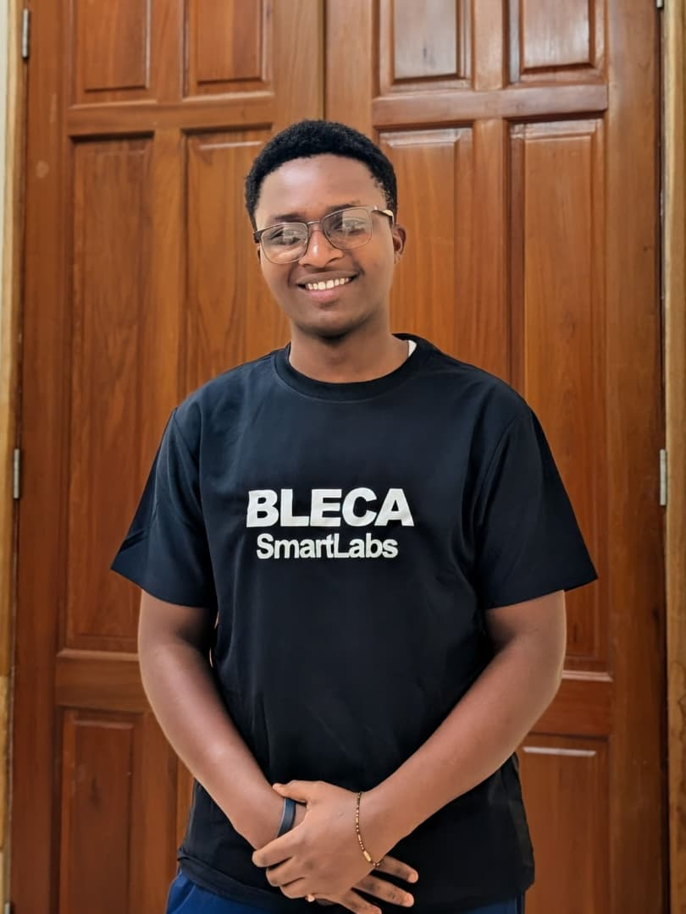

# About AdaptShot

## In one sentence

> **AdaptShot lets you teach a computer to recognise things from just 5 or 10 photos — and it tells you when it isn't sure, instead of guessing.**

Three facts, and they are the whole product:

1. **Few photos.** Five or ten examples per category, not thousands.
2. **Ordinary laptop.** No graphics card, no internet, no cloud account.
3. **Admits when it's unsure.** It flags what it doesn't recognise instead of picking an answer anyway.

---

## Where this started

I hit the wall myself first.

When I started training image models, I could not do it on my own computer — the
specifications were too small. I was not alone in that; other students around me had
exactly the same problem. So we all did what everybody does: we trained in the cloud.

But training online means *staying* online. And I could not afford to be connected
for hours at a time, day after day. That is the part nobody mentions: the standard
answer to "you don't have a GPU" is "use the cloud", which quietly assumes you have
cheap, uninterrupted internet instead. **When one resource is missing, the workaround
usually assumes another one you also don't have.**

Then I watched the same problem land on someone with more at stake than a student
assignment.

In 2025, I watched an agricultural extension worker in Mbeya, Tanzania try to
diagnose crop disease from phone photos. She had years of training and a
smartphone — but every AI tool available to her required cloud connectivity, GPU
acceleration, or thousands of labelled images. None of those exist in rural Tanzania.

Every state-of-the-art solution failed her.

She was not short of expertise. She was short of a tool that fit the conditions she
actually worked in.

Two versions of one problem. AdaptShot is an attempt to build the tool that assumes
none of it — no data centre, no fast connection, no thousand-image dataset — and that
is honest enough to say when it cannot help, so the person using it always knows when
to fall back on their own judgement.

---

## How it works, in plain language

You show it a few example photos of each thing you care about — say 5 healthy leaves
and 5 diseased leaves. Then you show it a new photo, and it tells you which one it
looks like.

The important part is the second half. It also tells you **how much to trust that
answer**. And when it sees something it doesn't recognise at all, it says *"I don't
know, ask a person"* rather than forcing the photo into one of the categories it knows.

---

## Two ideas worth understanding

You do not need the mathematics to use AdaptShot, but these two ideas are what make
it different from ordinary image classification.

### Honest confidence — like a weather forecast

When a forecast says "70% chance of rain," you can check it over a year. If it rained
on roughly 70 of the 100 days it said 70%, the forecast is honest. You can plan around it.

Most AI systems say "97% sure" and are wrong far more often than 3% of the time. This
is a [well-documented property](https://arxiv.org/abs/1706.04599) of modern neural
networks, not a bug in any one system. AdaptShot measures and corrects this, so its
confidence numbers are built to mean what they say.

### A short list you can trust — like a careful doctor

A careless doctor says "it's malaria" and is confidently wrong. A careful one says
"it's one of these two things, let's check."

Being given a short list you can trust is often more useful than one confident answer
that might be wrong. AdaptShot can return such a list, along with a mathematical
guarantee about how often the correct answer is inside it. The technical name is
*conformal prediction*; the useful description is **a short list you can trust**.

---

## What would I use it for?

The pattern to look for:

> Anywhere you need to sort or check images, you cannot collect thousands of labelled
> examples, and a wrong answer costs something real.

| Situation | How AdaptShot helps |
| :--- | :--- |
| **Crop disease** from leaf photos | An extension officer covers more farms; uncertain photos get escalated |
| **Quality control** on a small production line | Learns a new defect type from a handful of samples |
| **Clinical image triage**, with a clinician confirming every case | Calibrated confidence makes the sorting trustworthy; it never replaces the clinician |
| **Wildlife camera traps** | Runs on battery-powered hardware in the field, offline |
| **Document and form sorting** | New categories added from a few examples, no retraining pipeline |

The common thread: **a human is available to handle the hard cases, and AdaptShot's
job is to correctly identify which cases are hard.** It does not replace the expert.
It lets one expert cover far more ground.

!!! warning "On medical and safety-critical use"
    AdaptShot has not been clinically validated and is not a medical device. Any use
    in a healthcare setting must keep a qualified clinician in the loop for every
    case. Calibrated uncertainty reduces the risk of silent errors — it does not
    eliminate it.

---

## Why not just use a cloud AI service?

Hosted vision APIs are excellent when they fit. They need internet, they charge per
photo, and your images leave your device. They also cannot learn *your* five specific
categories from ten photographs.

AdaptShot runs offline on hardware you already own, and the data never leaves the room.

## Who should not use AdaptShot

If you have thousands of labelled photos and a good graphics card, train a
conventional model instead — you will get better accuracy. AdaptShot is built for
when you do not have those things.

Saying this plainly matters. A tool that claims to be right for everyone is right
for no one.

---

## Explaining it to different people

| They are | Say this |
| :--- | :--- |
| **A farmer or nurse** | "Take a photo, it tells you what it thinks it is — and it's honest when it doesn't know." |
| **A developer** | "A Python library for few-shot image classification with calibrated uncertainty and OOD detection. `pip install adaptshot`, five lines to a prediction. CPU-only, torch optional." |
| **A researcher** | "Conformal prediction in the few-shot regime on CPU — distribution-free marginal coverage with leave-one-out calibration when you only have five shots per class." |
| **A funder** | "It brings reliable image AI to places with no GPUs and no internet — and unlike most AI, it knows the limits of its own knowledge, so people can trust it." |

**Lead with the problem, never the technology.** "It uses conformal prediction with
Mahalanobis-based OOD detection" makes people nod and change the subject. "It tells
you when it isn't sure" makes them ask a follow-up question.

---

## Mission

> Make trustworthy image AI work in the places where AI usually doesn't — no GPU,
> no reliable internet, and very few labelled examples.

Most machine learning research assumes abundant data, abundant compute, and a fast
connection. A great many working environments have none of the three. AdaptShot is
built for those environments first, on the view that a method which survives the
hardest constraints will work comfortably everywhere else.

### Values

1. **Truth over hype.** Document what works, what doesn't, and what hasn't been
   measured yet. A small true claim beats a large unprovable one.
2. **Constraint-first engineering.** Design for the hardest environment first.
3. **Human dignity.** AI should extend human expertise, not replace it. Uncertain
   predictions get flagged for review, never silently guessed.
4. **Efficiency as a feature.** CPU-only inference is cheaper and lower-power than
   GPU alternatives. Where energy is measured, it is measured honestly.
5. **Built where it's needed.** Designed in Mbeya, for conditions like Mbeya's.

---

## How it got here

See the [changelog](https://github.com/johnson2006christopher/adaptshot/blob/main/CHANGELOG.md)
for full detail. The short version:

| Version | Theme |
| :--- | :--- |
| **v0.1.x** | **Built it.** Frozen-backbone feature extraction, similarity search, calibration, human corrections, energy-aware inference. |
| **v0.2.0** | **Made it honest.** Conformal prediction, multi-signal uncertainty, Mahalanobis OOD detection — alongside a substantial pass correcting claims the code did not yet support. |
| **v0.3.0** | **Made it provable.** Validation on real public datasets, a narrower and better-defended API, and the graphical tools split into their own project. |

That middle step is worth dwelling on. Much of v0.2.0 was not new features but
corrections: an uncertainty method that had been described but not implemented, a
projection head that was created but never trained, a calibration path that quietly
invalidated its own coverage guarantee. Finding and fixing those mattered more than
any feature added alongside them.

---

## Current status

AdaptShot is **pre-1.0**. The API may change between minor versions, and every change
is recorded in the changelog.

What exists today is a well-tested implementation of well-established methods —
prototypical networks, temperature scaling, split and cross conformal prediction,
Mahalanobis OOD detection — engineered for CPU-only operation and checked by `ruff`,
`mypy --strict`, and a full test suite on every change.

What does not exist yet is large-scale validation on real-world data. Benchmarks on
public datasets were the headline goal of v0.3.0, and they landed: the README's results section and the [technical note](understand/technical-note.md) carry them, every figure traced to a committed artifact by a test.

---

## About the creator

**Johnson Christopher Hassan** is a self-taught AI research engineer and a diploma
student in Computer Engineering at Mbeya University of Science and Technology,
Tanzania. AdaptShot was built on a standard laptop.

- 📍 Mbeya, Tanzania 🇹🇿
- ✉️ [johnson2006christopher@gmail.com](mailto:johnson2006christopher@gmail.com)
- 🐙 [GitHub](https://github.com/johnson2006christopher)
- 💼 [LinkedIn](https://www.linkedin.com/in/johnson-christopher-hassan)

---

## Get involved

- **Use it.** Deploy AdaptShot in your community and share what happened — including
  what didn't work. Negative results are genuinely useful here.
- **Contribute.** Submit a pull request, write a tutorial, or translate documentation.
- **Research it.** Ablation studies, comparisons, and extensions are all welcome.
- **Teach it.** The codebase is small enough to read end to end, which makes it
  usable in a classroom.

---

*The best AI doesn't guess confidently. 
It learns humbly, admits uncertainty, and improves through every human correction.*

[⭐ Star on GitHub](https://github.com/johnson2006christopher/adaptshot) ·
[📖 Documentation](https://johnson2006christopher.github.io/adaptshot/) ·
[💬 Discussions](https://github.com/johnson2006christopher/adaptshot/discussions)

