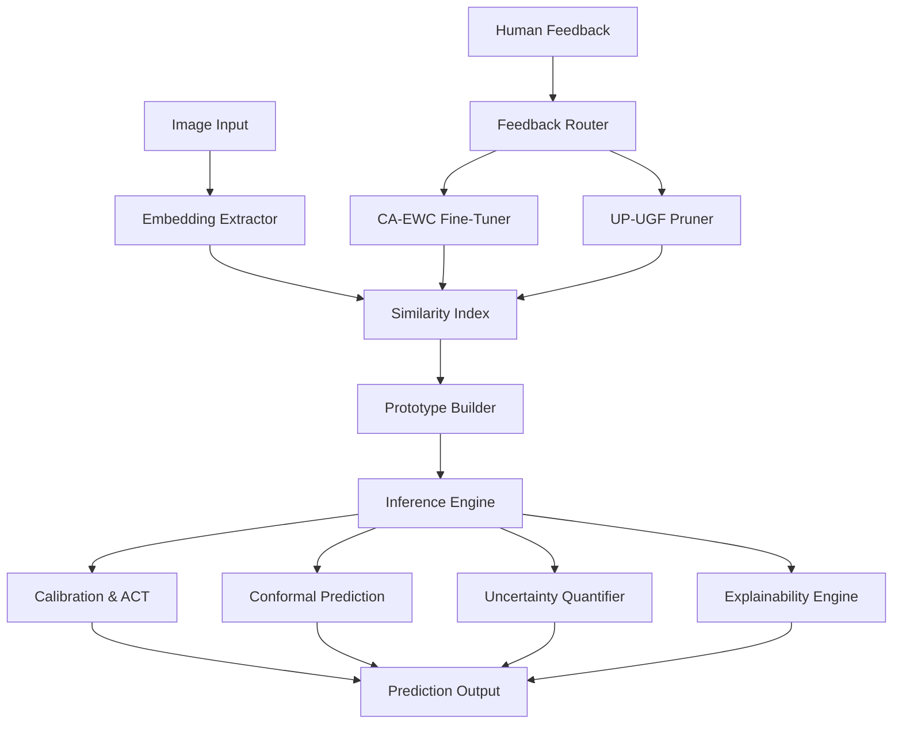
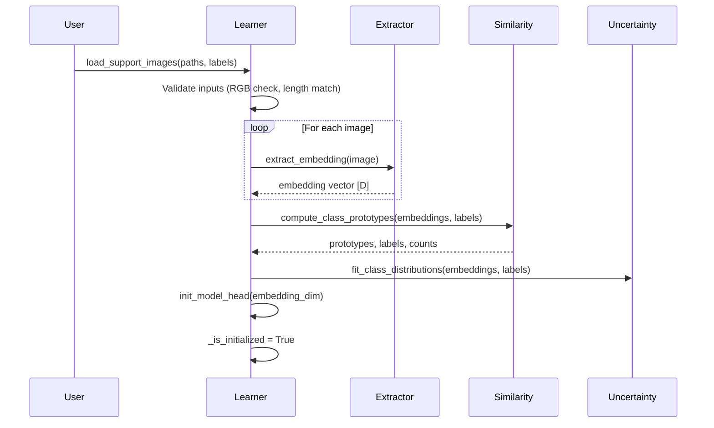
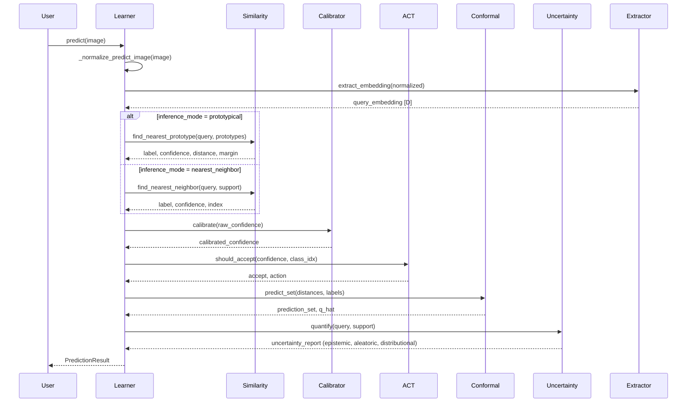
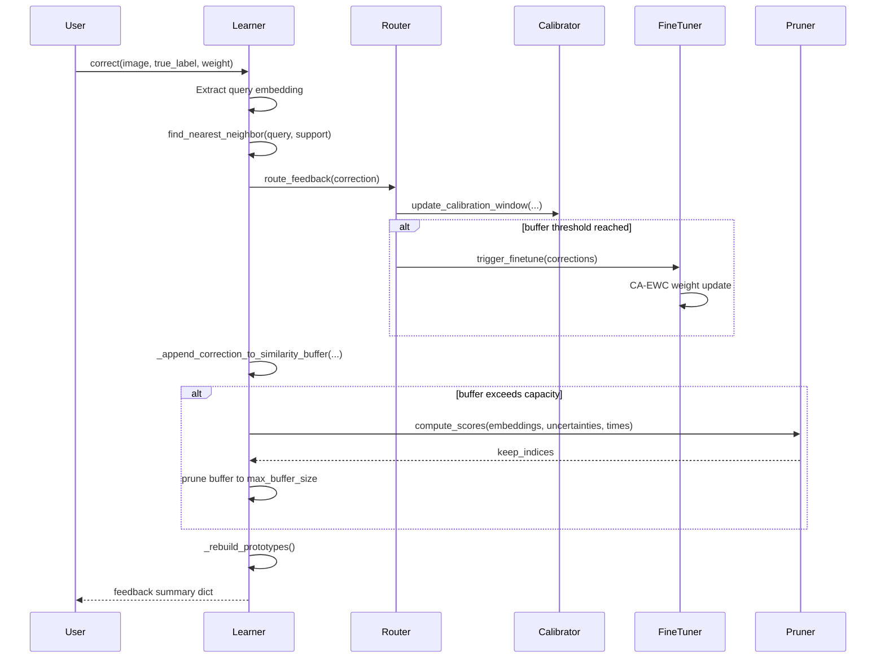

# AdaptShot Architecture Deep-Dive

> **v0.2.0** | Comprehensive system architecture and data flow documentation

---

## System Overview

AdaptShot is a human-aligned few-shot vision learning library designed for resource-constrained environments. It enables continual learning from minimal examples (5-10 per class) while incorporating human feedback to improve predictions over time.



---

## Module Architecture

```
src/adaptshot/
├── __init__.py              # Public API exports, version string
├── config/
│   └── settings.py          # Immutable AdaptShotConfig dataclass
├── core/
│   ├── learner.py           # FewShotLearner — main orchestrator
│   ├── extractor.py         # Embedding extraction (ONNX + PyTorch backends)
│   ├── similarity.py        # Distance metrics, k-NN, prototype search
│   ├── calibration.py       # Temperature scaling, ECE, Platt scaling
│   ├── act.py               # Adaptive Confidence Thresholding engine
│   ├── conformal.py         # v0.2.0: Distribution-free conformal prediction
│   ├── contrastive.py       # v0.2.0: Contrastive prototype learning
│   ├── uncertainty.py       # v0.2.0: Multi-signal uncertainty quantification
│   └── explain.py           # v0.2.0: XAI explainability module
├── training/
│   ├── feedback_router.py   # Corrections routing with fine-tune triggers
│   ├── finetune.py          # CA-EWC continual fine-tuning
│   └── up_ugf.py            # UP-UGF buffer management and pruning
├── utils/
│   ├── exceptions.py        # Custom exception hierarchy
│   └── migrations.py        # Checkpoint schema migration
└── studio/                  # Gradio-based UI (Pilot Dashboard, Studio)
```

---

## Core Data Flow

### 1. Support Set Loading (`load_support_images`)



### 2. Prediction Flow (`predict`)



### 3. Human Feedback Loop (`correct`)



---

## Key Design Decisions

### Numpy-First Architecture
All core algorithms (conformal prediction, contrastive learning, uncertainty quantification, explainability) are implemented in pure NumPy. PyTorch is optional and only required for:
- Backbone embedding extraction (ResNet18, MobileNetV3)
- CA-EWC fine-tuning
- Model head training

This ensures AdaptShot works on CPU-only systems with minimal dependencies.

### Immutable Configuration
`AdaptShotConfig` is a frozen dataclass — once created, hyperparameters cannot be mutated. This guarantees:
- Deterministic reproducibility across runs
- Safe sharing of configs between threads
- Clear audit trail of all pipeline parameters

### Schema-Versioned Persistence
Checkpoints are saved with a `schema_version` field, enabling:
- Forward compatibility: new versions can load old checkpoints
- Integrity verification: SHA-256 hashes of config + embeddings
- Migration support: automatic upgrades from v0.1.0 → v0.1.1 → v0.2.0

### Backend Abstraction
The `extractor.py` module abstracts over:
- ONNX Runtime (default, no PyTorch dependency)
- PyTorch (for GPU acceleration)
- Embedding caching (avoid re-extraction for repeated images)

---

## Memory Layout

### Support Buffer
```
_sim_embeddings: List[np.ndarray]     # [N, D] floating-point embeddings
_sim_labels: List[Union[str, int]]    # Class labels
_sim_access_times: List[float]        # Last access timestamps
_sim_uncertainties: List[float]       # Per-example uncertainty scores
_sim_preview_signatures: List[np.ndarray]  # 48-dim preview vectors
```

### Prototype Storage
```
_prototype_embeddings: np.ndarray     # [K, D] class centroids
_prototype_labels: np.ndarray         # [K] class labels
_prototype_counts: np.ndarray         # [K] examples per class
```

### Calibration Window
```
_window_confidences: List[float]      # Rolling window of raw confidences
_window_correct: List[bool]           # Whether each prediction was correct
_ece_history: List[float]             # Historical ECE values
```

---

## Thread Safety

All learner state mutations happen in a single thread. The design is intentionally single-threaded for:
- Simplicity: no locks, no race conditions
- Predictability: deterministic execution order
- Compatibility: works with Python's GIL model

For multi-threaded use, create separate `FewShotLearner` instances or serialize access externally.

---

## Next Steps

- [Algorithm Theory Deep-Dive](algorithm-theory.md) — mathematical foundations
- [API Reference](../api/reference.md) — complete public API
- [Configuration Reference](../reference/config-reference.md) — all config fields
