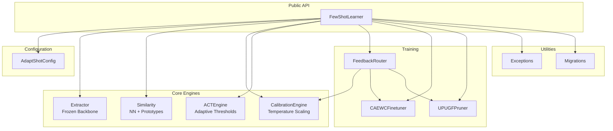

# AdaptShot Architecture & System Design

**Complete architecture reference: component relationships, data flow, module responsibilities, and extension points.**

This guide maps every module in AdaptShot, explains how components interact, and shows where to add new functionality. Use it to understand the codebase at a systems level.

---

## High-Level Architecture

```
┌─────────────────────────────────────────────────────────────┐
│                      AdaptShot System                        │
├───────────────┬───────────────┬───────────────┬─────────────┤
│   config/     │    core/      │  training/    │   utils/    │
│  settings.py  │  learner.py   │ feedback.py   │ exceptions  │
│               │  extractor.py │ finetune.py   │ migrations  │
│               │  similarity.py│ up_ugf.py     │             │
│               │  calibration  │               │             │
│               │  act.py       │               │             │
├───────────────┴───────────────┴───────────────┴─────────────┤
│                        Applications                          │
├───────────────────┬────────────────────┬────────────────────┤
│   ui/app.py       │  studio/app.py     │  mziziguard/       │  <- three GUIs; being replaced by one (#45).
│                   │                    │  (worked example,  │     mziziguard's sample data is synthetic.
│                   │                    │   synthetic data)  │
│   (Gradio pilot)  │  (Offline studio)  │  (Crop diagnosis)  │
└───────────────────┴────────────────────┴────────────────────┘
```

## Module Map

### `config/settings.py` — Configuration

**Responsibility**: Central, immutable configuration for the entire pipeline.

```python
@dataclass(frozen=True)
class AdaptShotConfig:
    backbone: str           # "resnet18" | "mobilenet_v3_small"
    device: str             # "cpu" | "cuda" | "mps"
    seed: int               # Determinism seed
    n_way: int              # Classes per episode
    k_shot: int             # Support examples per class
    query_size: int         # Query examples per class
    use_faiss: bool         # FAISS acceleration toggle
    faiss_nprobe: int       # FAISS IVF probe depth
    similarity_metric: str  # "cosine" | "euclidean"
    inference_mode: str     # "prototypical" | "nearest_neighbor"
    eco_mode: bool          # Carbon-aware inference
    early_exit_threshold: float
    calibration_method: str # "temperature" | "scaling_binning" | "conformal"
    ece_n_bins: int         # ECE bins
    temperature_init: float
    recalibrate_after_feedback: bool
    enable_ood_detection: bool
    ood_threshold_quantile: float
    ood_absolute_min_distance: float
    max_buffer_size: int
    verbose: bool
    log_dir: Optional[str]
```

**Key design**: Frozen dataclass. Once created, cannot be mutated. This guarantees that pipeline hyperparameters stay constant during inference — critical for reproducible CI/CD.

### `core/learner.py` — FewShotLearner (1254 lines)

**Responsibility**: Main public API. Orchestrates all subsystems.

**Public methods**:
| Method | Purpose |
|--------|---------|
| `load_support_images()` | Ingest support set, build index |
| `predict()` | Run inference with calibration + ACT |
| `correct()` | Route human correction |
| `correct_comparative()` | Ordinal feedback (prefer A over B) |
| `calibration_report()` | Diagnostics for monitoring |
| `save()` / `load()` | Persistence |

**Internal subsystems managed**:
- `self.calibrator: CalibrationEngine` — temperature scaling
- `self.act: ACTEngine` — adaptive thresholds
- `self.router: FeedbackRouter` — correction pipeline
- `self.finetuner: CAEWCFinetuner` — head adaptation
- `self.pruner: UPUGFPruner` — buffer management
- `self._embedding_cache: EmbeddingCache` — avoid re-extraction

### `core/extractor.py` — Embedding Extraction

**Responsibility**: Load pretrained backbones and extract embeddings.

**Key functions**:
| Function | Purpose |
|----------|---------|
| `extract_embedding(image, backbone)` | Core extraction pipeline |
| `compute_preview_signature(image)` | Lightweight image hash for caching |
| `BACKBONE_OUTPUT_DIM` | Constant: 512 (resnet18) or 576 (mobilenet_v3_small) |

**EmbeddingCache class**: Stores `(preview_signature → embedding)` pairs. Skips expensive backbone forward pass when same image is predicted multiple times.

### `core/similarity.py` — Similarity Search

**Responsibility**: Compare query embeddings against support set.

**Key functions**:
| Function | Purpose |
|----------|---------|
| `find_nearest_neighbor()` | 1-NN search over support set |
| `find_nearest_prototype()` | Query-to-class-centroid comparison |
| `compute_class_prototypes()` | Mean embedding per class |
| `euclidean_distance_numpy()` | Vectorized Euclidean distance |

### `core/calibration.py` — CalibrationEngine

**Responsibility**: Online temperature scaling + ECE computation.

**Key methods**:
| Method | Purpose |
|--------|---------|
| `update()` | Add observation to sliding window |
| `calibrate()` | Apply temperature scaling to raw score |
| `compute_ece()` | Expected Calibration Error |
| `calibration_summary()` | Dict of ECE, temperature, window size |

### `core/act.py` — ACTEngine

**Responsibility**: Adaptive per-class confidence thresholds.

**Key methods**:
| Method | Purpose |
|--------|---------|
| `should_accept()` | Decide: accept or request feedback |
| `update_threshold()` | Adjust threshold based on correction outcome |
| `get_threshold()` | Current threshold for a class |
| `get_all_thresholds()` | Snapshot of all thresholds |

### `training/feedback_router.py` — FeedbackRouter

**Responsibility**: Route corrections through the pipeline.

**Correction dataclass**:
```python
@dataclass
class Correction:
    image_path: str
    predicted_label: int
    corrected_label: int
    raw_confidence: float
    confidence_weight: float
    timestamp: float
    metadata: Dict[str, Any]
```

**Key methods**:
| Method | Purpose |
|--------|---------|
| `route_feedback()` | Main entry: update calibration, queue, fine-tune decision |

### `training/finetune.py` — CAEWCFinetuner

**Responsibility**: Continual fine-tuning with elastic weight consolidation.

**Key methods**:
| Method | Purpose |
|--------|---------|
| `fine_tune()` | Run CA-EWC optimization on classification head |
| `_compute_fisher()` | Fisher Information Matrix from support set |
| `_compute_class_weights()` | Per-class importance for weighted FIM |

### `training/up_ugf.py` — UPUGFPruner

**Responsibility**: Uncertainty-guided buffer pruning.

**Key methods**:
| Method | Purpose |
|--------|---------|
| `prune()` | Score+evict items to enforce max_buffer_size |

### `utils/exceptions.py` — Error Hierarchy

```
AdaptShotError (base)
├── ConfigValidationError
├── InvalidImageError
├── CalibrationNotReadyError
└── BufferCapacityError
```

### `utils/migrations.py` — Schema Migration

Handles forward compatibility for checkpoint formats between versions.

---

## Component Dependency Graph



---

## Request Lifecycle

### 1. `load_support_images(paths, labels)`

```
User Code
  → FewShotLearner.load_support_images()
    → _validate_support_inputs()          # ConfigValidationError on mismatch
    → For each (path, label):
      → _load_rgb_image_from_path()       # InvalidImageError on failure
      → compute_preview_signature()       # Cache key
      → _extract_embedding_checked()      # Backbone forward
      → Append to _sim_embeddings
      → Append to _sim_labels
    → _rebuild_label_index()              # Map labels ↔ indices
    → _rebuild_prototypes()               # Compute class centroids
    → _update_ood_threshold()             # Fit distance threshold
    → _init_or_rebuild_model_head()       # Create classification head
    → _is_initialized = True
```

### 2. `predict(image)`

```
User Code
  → FewShotLearner.predict()
    → _ensure_initialized()               # AdaptShotError if not
    → _normalize_predict_image()          # File/array/PIL → normalized tensor
    → _extract_embedding_checked()        # Backbone forward
    → If prototypical:
      → find_nearest_prototype()          # Query vs. class centroids
      → return label, raw_conf, distance, margin
    → Else:
      → find_nearest_neighbor()           # Query vs. all support embeddings
      → return label, raw_conf, neighbor_idx
    → Calibrator.calibrate_or_raise()     # Temperature scaling
    → ACT.should_accept()                 # Adaptive threshold check
    → _is_out_of_distribution()           # OOD flag
    → Update access_times, uncertainties  # For UP-UGF scoring
    → Return PredictionResult
```

### 3. `correct(image_path, true_label, confidence_weight)`

```
User Code
  → FewShotLearner.correct()
    → _ensure_initialized()
    → _validate_label(true_label)
    → Extract embedding from image_path
    → find_nearest_neighbor()             # What did model predict?
    → Create Correction dataclass
    → router.route_feedback(correction)
      → Calibrator.update()               # Add to sliding window
      → Queue correction
      → If queue >= trigger: CA-EWC fine-tune
    → Append embedding to buffer with true_label
    → Rebuild prototypes
    → Update OOD threshold
    → UP-UGF prune (if over capacity)
    → Return result dict
```

---

## Extension Points

### Adding a New Calibration Method

1. Add method name to `Literal` type in `AdaptShotConfig.calibration_method`
2. Implement in `CalibrationEngine._refit_temperature()`
3. Add ECE computation variant if needed

### Adding a New Backbone

1. Add backbone name to `Literal` type in `AdaptShotConfig.backbone`
2. Add loading logic in `extractor.py`
3. Set `BACKBONE_OUTPUT_DIM` to the backbone's embedding dimension
4. Add to downstream tests

### Adding a New Inference Mode

1. Add mode name to `Literal` type
2. Implement search function in `similarity.py`
3. Add branch in `FewShotLearner.predict()`

---

## Thread Safety

AdaptShot is **single-threaded by design**. There are no locks, no async operations, and no shared mutable state between instances. Each `FewShotLearner` instance is fully independent.

For concurrent use, create multiple instances:

```python
learner_a = FewShotLearner(config=config)
learner_b = FewShotLearner(config=config)
# Each has its own embeddings, calibration, ACT state
```

---

## Testing Architecture

```
tests/
├── test_calibration.py    # ECE computation, temperature fitting
├── test_exceptions.py     # All exception types and messages
├── test_extractor.py      # Embedding extraction, caching
├── test_feedback_router.py # Correction routing, fine-tune triggers
├── test_persistence.py    # Save/load roundtrip
├── test_release_metadata.py # Version, metadata consistency
├── test_similarity.py     # NN and prototype search
└── test_studio_utils.py   # Studio utility functions
```

All tests are CPU-only and self-contained. Run with:

```bash
pytest tests/ -v
```

---

*Created by [Johnson Christopher Hassan](https://github.com/johnson2006christopher)*  
*Connect on [LinkedIn](https://www.linkedin.com/in/johnson-hassan-935124311/)*  
*Project: [github.com/johnson2006christopher/adaptshot](https://github.com/johnson2006christopher/adaptshot)*
