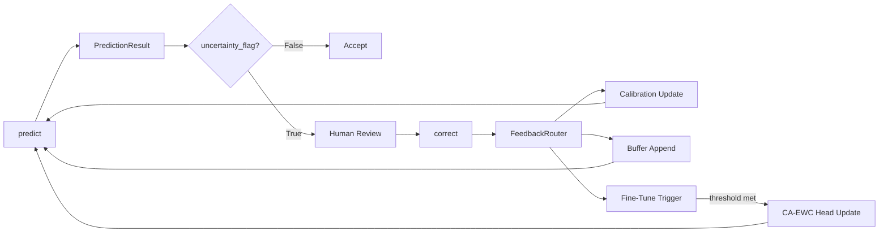

# Human-in-the-Loop: Deep Dive

AdaptShot's human-in-the-loop (HITL) system is not an afterthought -- it is the core design philosophy. Every prediction can be corrected, and every correction improves the model. This guide explains the full feedback loop from API call to internal state changes.

---

## The Closed-Loop Architecture



The loop is continuous: predictions inform corrections, corrections refine calibration, and accumulated corrections trigger lightweight fine-tuning. The model gets better with use.

---

## Step 1: Making a Prediction

```python
result = learner.predict("field_photo.jpg")
```

`predict()` returns a `PredictionResult` dataclass with these fields:

| Field | Type | Description |
|-------|------|-------------|
| `prediction` | `Union[str, int]` | Predicted class label |
| `raw_confidence` | `float` | Raw similarity score (before calibration) |
| `calibrated_confidence` | `float` | Temperature-scaled confidence in [0.0, 1.0] |
| `neighbor_idx` | `int` | Index of nearest support example in buffer |
| `uncertainty_flag` | `bool` | `True` if ACT or OOD rejected the prediction |
| `act_action` | `str` | `"ACCEPT"`, `"REQUEST_FEEDBACK"`, or `"REQUEST_FEEDBACK_OOD"` |
| `distance_to_prototype` | `float` | Distance to nearest class prototype |
| `prototype_margin` | `float` | Margin to second-nearest prototype |
| `ood_flag` | `bool` | `True` if image is out-of-distribution |
| `debiased_ece` | `float` | Current debiased Expected Calibration Error |

### Decision Logic Inside predict()

The pipeline makes three sequential gating decisions:

1. **Similarity Search**: Find the nearest match (nearest-neighbor or prototypical)
2. **Calibration**: Scale raw confidence to calibrated probability
3. **ACT Gating**: `ACTEngine.should_accept()` checks the calibrated confidence against an adaptive per-class threshold
4. **OOD Check**: If the image is too far from any known prototype, override ACT to `REQUEST_FEEDBACK_OOD`

---

## Step 2: Interpreting the Result

Use the decision tree from [Tutorial 2](../tutorials/02_human_in_the_loop.md):

```
if calibrated_confidence >= 0.8 AND uncertainty_flag == False:
    -> ACCEPT the prediction
else:
    -> REQUEST human review
    -> If human disagrees, call learner.correct()
```

You can also use a more nuanced approach:

```python
def decide_action(result: PredictionResult) -> str:
    if result.ood_flag:
        return "REJECT"           # Image doesn't match anything we know
    if result.uncertainty_flag:
        return "REVIEW"           # ACT says we need human input
    if result.calibrated_confidence < 0.70:
        return "REVIEW"           # Low confidence even if ACT accepted
    if result.prototype_margin < 0.05:
        return "REVIEW"           # Very close to another class
    return "ACCEPT"
```

---

## Step 3: Routing a Correction

When a human corrects a prediction:

```python
feedback = learner.correct(
    image_path="field_photo.jpg",
    true_label="maize_blight",      # Human-provided true label
    confidence_weight=0.95,          # How sure the human is [0.0, 1.0]
)
```

`correct()` returns a dictionary:

| Key | Type | Description |
|-----|------|-------------|
| `buffer_size` | `int` | Current replay buffer size |
| `pending_corrections` | `int` | Corrections awaiting fine-tune trigger |
| `calibration_updated` | `bool` | Whether ECE/temperature was updated |
| `fine_tuned` | `bool` | Whether CA-EWC head optimization ran |
| `total_corrections` | `int` | Lifetime correction count |
| `calibration_summary` | `dict` | (if `recalibrate_after_feedback=True`) |
| `buffer_management_warning` | `str` | (if pruning encountered issues) |

### What Happens Internally

When you call `correct()`, the learner:

1. **Extracts embedding** from the corrected image
2. **Finds nearest neighbor** to determine what the model originally predicted
3. **Creates a `Correction` dataclass** with predicted label, corrected label, confidence weight, and metadata (original string labels are preserved in `metadata`)
4. **Routes through `FeedbackRouter.route_feedback()`**:
   - Updates the calibration sliding window with the correction
   - Appends the correction to the pending queue
   - If pending corrections >= threshold: triggers CA-EWC fine-tuning
5. **Appends to similarity buffer**: The corrected image becomes a new support example
6. **Rebuilds prototypes** and updates OOD thresholds
7. **Applies buffer management**: If buffer exceeds `max_buffer_size`, UP-UGF pruning runs

---

## Step 4: Understanding Confidence Weight

`confidence_weight` (0.0 to 1.0) represents the human expert's certainty:

| Weight | Meaning | Effect |
|--------|---------|--------|
| `1.0` | "I am 100% certain this label is correct" | Full adaptation -- the model learns aggressively from this correction |
| `0.7` | "I'm fairly sure but could be wrong" | Moderate adaptation -- balanced learning |
| `0.3` | "I'm guessing -- this is a hard case" | Cautious adaptation -- model preserves prior knowledge |

The weight flows into CA-EWC fine-tuning: higher confidence reduces the Elastic Weight Consolidation penalty, allowing faster adaptation. Lower confidence preserves prior knowledge to prevent the model from overfitting to uncertain corrections.

---

## Step 5: Comparative Feedback (v0.1.1+)

For cases where absolute labels are hard but relative comparisons are easy:

```python
result = learner.correct_comparative(
    image_path="hard_case.jpg",
    preferred_label="maize_blight",      # "More like blight than healthy"
    alternative_label="maize_healthy",
    confidence_weight=0.8,
)
```

This maps a relative question ("is this more like A or B?") to a standard correction update. The result includes comparative diagnostics:

```python
{
    "calibration_updated": True,
    "comparative_feedback": {
        "preferred_label": "maize_blight",
        "alternative_label": "maize_healthy",
        "preferred_distance": 0.34,
        "alternative_distance": 0.67,
        "supports_preference": True,  # preferred is indeed closer
    },
}
```

---

## Step 6: Calibration Report

Monitor how well the model is learning from corrections:

```python
report = learner.calibration_report()
print(report)
# {
#     "current_temperature": 0.82,
#     "current_ece": 0.043,
#     "debiased_ece": 0.038,
#     "ood_distance_threshold": 0.27,
#     "support_size": 47,
#     "prototype_count": 12,
# }
```

| Field | Good | Concerning |
|-------|------|------------|
| `current_ece` | < 0.05 | > 0.15 |
| `current_temperature` | 0.5 - 1.5 | > 3.0 (severe miscalibration) |
| `support_size` | Growing steadily | Stagnant (no corrections happening) |
| `prototype_count` | Stable or growing | Shrinking (classes being lost) |

---

## Step 7: Persistence -- Saving the Learned State

All corrections and fine-tuning are lost when the process exits unless you save:

```python
learner.save("checkpoints/session.json")
```

This creates three files:
- `session.json` -- metadata, config, calibration, ACT thresholds, buffer labels, integrity checksums
- `session.embeddings.npy` -- all support and correction embeddings as NumPy array
- `session.head.pt` -- fine-tuned classification head weights (if fine-tuning has run)

Load a previous session:

```python
restored = FewShotLearner.load("checkpoints/session.json")
```

The loader validates checksums, runs schema migration if needed, and restores all internal state including calibration history and ACT thresholds.

---

## Step 8: The Fine-Tuning Trigger

CA-EWC fine-tuning runs automatically when pending corrections accumulate:

```
trigger_threshold = max(5, max_buffer_size // 10)
```

With `max_buffer_size=100`, fine-tuning triggers after 10 pending corrections. The process:

1. Computes Fisher Information on the current support set (importance weights)
2. Runs head-only optimization with EWC regularization
3. Correction confidence weights modulate the regularization strength
4. Pending queue is cleared after successful fine-tuning

The backbone remains frozen throughout. Only the lightweight classification head is updated -- keeping everything CPU-efficient.

---

## Verification Checklist

- [ ] You can call `predict()` and interpret all fields in `PredictionResult`.
- [ ] You can call `correct()` with a string label and confidence weight.
- [ ] You understand what each key in the `correct()` return dict means.
- [ ] You can call `calibration_report()` and assess whether ECE is healthy.
- [ ] You can save and load a learner with `save()` / `load()`.
- [ ] You understand the difference between `correct()` and `correct_comparative()`.
- [ ] You can trace each step to the source code at `src/adaptshot/core/learner.py`.

---

*Created by [Johnson Christopher Hassan](https://github.com/johnson2006christopher)*  
*Connect on [LinkedIn](https://www.linkedin.com/in/johnson-hassan-935124311/)*  
*Project: [github.com/johnson2006christopher/adaptshot](https://github.com/johnson2006christopher/adaptshot)*
