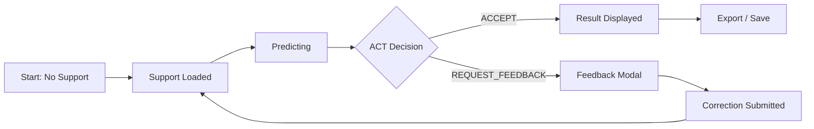

# AdaptShot Studio: Complete Guide

> **v0.2.0** | Comprehensive guide to the Gradio-based Studio Dashboard

---

## Overview

AdaptShot Studio is a Gradio web interface for interactive few-shot learning. It provides visual configuration, support set management, inference with diagnostics, and human feedback integration — all without writing code.

**Launch**: `adaptshot-studio` from the command line, or `python -m adaptshot.studio.app`

---

## Screenshot 1: Dashboard Hero

**Dimensions**: 1920×1080 (full viewport)
**What to capture**: Top section of the Studio interface showing the main configuration panel

### UI Elements (top to bottom)

| Element | Position | Description |
|---------|----------|-------------|
| **Title Bar** | Top center | "AdaptShot Studio v0.2.0" with version badge |
| **Backbone Selector** | Upper-left card | Dropdown: `resnet18` or `mobilenet_v3_small` |
| **Inference Mode** | Next to backbone | Radio buttons: Nearest Neighbor / Prototypical / Contrastive |
| **Eco Mode Toggle** | Top-right card | Toggle switch with leaf icon; shows estimated energy savings |
| **Similarity Metric** | Below backbone | Dropdown: `cosine` or `euclidean` |
| **Device Indicator** | Bottom of config card | Shows `CPU` with green dot when active |
| **Load Support Set Button** | Center action bar | Primary button: "📁 Load Support Set" |
| **Status Bar** | Bottom | "Ready" / "Initialized with N classes" |

### Expected Data
- Backbone: `resnet18` (default)
- Inference mode: `Prototypical` selected
- Eco mode: OFF
- Metric: `euclidean`

### Color Reference
- Primary: `#1a73e8` (Google Blue)
- Background: `#f8f9fa`
- Cards: `#ffffff` with subtle shadow
- Status green: `#34a853`

---

## Screenshot 2: Support Set Loading

**Dimensions**: 1920×1080 (full viewport)
**What to capture**: The file upload interface with loaded support set and class distribution

### UI Elements

| Element | Position | Description |
|---------|----------|-------------|
| **File Upload Area** | Left panel (60%) | Drag-and-drop zone with "+" icon and "Drop images here or click to browse" |
| **Folder Path Input** | Below upload area | Text input for directory path; "Scan Folder" button |
| **Label Strategy Selector** | Below folder input | Dropdown: "From folder names" / "From filenames" / "Manual assignment" |
| **Image Grid** | Center panel | Thumbnail grid of loaded support images (4×N grid, 120px thumbnails) |
| **Class Distribution** | Right panel (40%) | Bar chart showing images per class |
| **Class Labels** | Below chart | List: "cat: 10 images", "dog: 10 images", etc. |
| **Confirm Button** | Bottom right | "✅ Confirm & Initialize" (blue, 200px wide) |
| **Cancel Button** | Next to confirm | "Cancel" (gray outline) |

### Expected Data
- 20 images loaded across 3 classes
- Class distribution: cat=8, dog=7, bird=5
- Folder path: `/data/support_set/`

---

## Screenshot 3: Inference Results

**Dimensions**: 1920×1080 (full viewport)
**What to capture**: Query image with prediction results, confidence gauges, and nearest neighbors

### UI Elements

| Element | Position | Description |
|---------|----------|-------------|
| **Query Image** | Left panel (50%) | Uploaded query image displayed at 400×400 |
| **Prediction Label** | Above image | Bold text: "Prediction: cat" with confidence percentage |
| **Confidence Gauge** | Right of prediction | Semi-circular gauge (0-100%) with color gradient (red→yellow→green) |
| **Calibration Info** | Below gauge | "Raw: 0.92 | Calibrated: 0.87 | Δ: -0.05" |
| **ACT Decision Badge** | Below calibration | Green badge "✓ ACCEPTED" or orange "⚠ NEEDS REVIEW" |
| **Conformal Set** | Right panel (50%) | Card: "Conformal Set (95% coverage)" with class tags |
| **Uncertainty Panel** | Below conformal | Three horizontal bars: Epistemic (blue), Aleatoric (orange), Distributional (red) |
| **Nearest Neighbors** | Bottom panel | Horizontal scroll of 5 support image thumbnails with similarity scores |
| **Explain Button** | Bottom right | "🔍 Explain Prediction" link |
| **Correct Button** | Next to explain | "✏️ Correct" opens feedback modal |

### Expected Data
- Prediction: dog, confidence 87%
- ACT: ACCEPTED
- Conformal set: [dog, cat] (2 classes)
- Uncertainty: epistemic=0.08, aleatoric=0.12, distributional=0.05
- Nearest neighbor: support example #3, similarity=0.92

---

## Screenshot 4: Human Feedback Panel

**Dimensions**: 800×600 (modal overlay)
**What to capture**: The correction input modal with feedback options

### UI Elements

| Element | Position | Description |
|---------|----------|-------------|
| **Modal Title** | Top | "Submit Correction" with ✏️ icon |
| **Current Prediction** | Below title | "Model predicted: dog (0.87)" in gray text |
| **True Label Input** | Center | Text input or dropdown of known classes |
| **Confidence Slider** | Below label | Range 0.0-1.0 with "How confident are you?" label |
| **Slider Value** | Right of slider | Shows current value (e.g., 0.90) |
| **Comparative Option** | Below slider | Checkbox: "This was a comparative judgment" |
| **Alternative Label** | Conditional | Appears when comparative is checked; dropdown of other classes |
| **Submit Button** | Bottom right | "Submit Correction" (blue) |
| **Cancel Button** | Next to submit | "Cancel" (gray) |
| **Buffer Status** | Bottom left | "Buffer: 102/200" with thin progress bar |

### Expected Data
- Current prediction: dog
- True label input shows "cat" being typed
- Confidence slider at 0.9
- Buffer: 102/200 (51%)

---

## Screenshot 5: Diagnostics Dashboard

**Dimensions**: 1920×1080 (full viewport)
**What to capture**: The monitoring/diagnostics tab with charts and metrics

### UI Elements

| Element | Position | Description |
|---------|----------|-------------|
| **ECE Chart** | Top-left card | Line chart: ECE over time (last 100 predictions) |
| **Current ECE** | Above chart | "Debiased ECE: 0.042" with trend arrow |
| **Buffer Memory Gauge** | Top-right card | Circular gauge: "Buffer: 85/200 (42%)" |
| **Latency Profile** | Middle-left | Bar chart: avg inference time per step (extract, search, calibrate, act) |
| **Calibration History** | Middle-right | Scatter plot: raw confidence vs. accuracy |
| **Conformal Coverage** | Bottom-left | Line chart: observed coverage vs. target (dashed line at 95%) |
| **OOD Rate** | Bottom-right | "OOD Rate: 2.3%" with sparkline |
| **Per-Class Accuracy** | Bottom table | Table: class name, support count, accuracy, threshold |
| **Refresh Button** | Top right corner | "🔄 Refresh" (updates all charts) |

### Expected Data
- ECE: 0.042 trending down
- Buffer: 85/200 (42%)
- Latency: extract=45ms, search=8ms, calibrate=2ms, act=1ms, total=56ms
- Conformal coverage: 94.7% (close to 95% target)
- OOD rate: 2.3%
- 12 classes in accuracy table

---

## Screenshot 6: Export & Deployment Bundle

**Dimensions**: 800×600 (modal or panel)
**What to capture**: The export configuration interface

### UI Elements

| Element | Position | Description |
|---------|----------|-------------|
| **Export Title** | Top | "Export Deployment Bundle" |
| **Checkpoint Path** | Text field | Pre-filled with last save path |
| **Include Model Head** | Checkbox | "Include CA-EWC model head (.pt)" checked |
| **Include Embeddings** | Checkbox | "Include support embeddings (.npy)" checked |
| **Include ONNX Model** | Checkbox | "Include ONNX backbone (.onnx)" unchecked |
| **Export Format** | Radio | "Full Bundle" / "Embeddings Only" / "Config Only" |
| **Estimated Size** | Text | "Estimated: 24.3 MB" |
| **Export Button** | Bottom right | "📦 Export Bundle" |
| **Download Progress** | Center | Progress bar during export (0% → 100%) |
| **Success Message** | Green banner | "✅ Bundle exported to adaptshot_bundle_2025.tar.gz" |
| **Download Link** | Below message | "Click to download" link |

### Expected Data
- Checkpoint: `./checkpoints/production_20250115_142300.json`
- Model head: 0.5 MB
- Embeddings: 23.8 MB
- Total: 24.3 MB

---

## State Transitions

---

## Keyboard Shortcuts

| Key | Action |
|-----|--------|
| `Ctrl+O` | Open support set |
| `Ctrl+P` | Predict on uploaded image |
| `Ctrl+E` | Explain current prediction |
| `Ctrl+S` | Save checkpoint |
| `Ctrl+R` | Refresh diagnostics |
| `Esc` | Close modal / cancel |

---

## Troubleshooting

| Issue | Solution |
|-------|----------|
| Studio won't start | Install GUI extras: `pip install "adaptshot[gui]"` |
| Images appear black | Ensure images are RGB, not CMYK or grayscale |
| Predictions are slow | Enable Eco Mode or switch to MobileNetV3 backbone |
| Charts not updating | Click "Refresh" or reduce `max_buffer_size` |
| Export fails | Check disk space; embeddings can be large |
