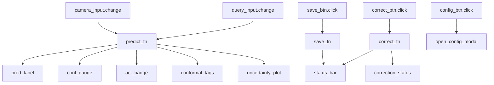

# UI Pilot Dashboard Guide

> **v0.2.0** | Gradio-based Pilot Dashboard for lightweight inference and feedback

---

## Overview

The Pilot Dashboard is a streamlined Gradio interface focused on rapid inference and human feedback collection. It's lighter than Studio and ideal for:
- Quick model evaluation
- Human annotation workflows
- Correction routing to the continual learning pipeline

**Launch**: Included in `adaptshot-studio` or as standalone component

---

## Screenshot 7: Pilot Dashboard Full View

**Dimensions**: 1280×900
**What to capture**: The complete Pilot Dashboard with all panels visible

### UI Layout

```
┌─────────────────────────────────────────────────────────┐
│                   AdaptShot Pilot v0.2.0                  │
├──────────────────────┬──────────────────────────────────┤
│                      │                                  │
│   Query Image        │   Prediction Result              │
│   ┌──────────────┐   │   ┌──────────────────────────┐   │
│   │              │   │   │ Class: cat               │   │
│   │  [Image]     │   │   │ Confidence: 87%          │   │
│   │              │   │   │ ACT: ACCEPTED            │   │
│   │              │   │   │ OOD: No                  │   │
│   └──────────────┘   │   └──────────────────────────┘   │
│                      │                                  │
│   [Upload] [Camera]  │   Conformal Set                  │
│                      │   ┌──────────────────────────┐   │
│                      │   │ [cat] [dog]               │   │
│                      │   └──────────────────────────┘   │
│                      │                                  │
│                      │   Uncertainty                    │
│                      │   Epistemic:  ████░░ 0.08       │
│                      │   Aleatoric:  ██████ 0.12      │
│                      │   Composite:  █████░ 0.12      │
├──────────────────────┴──────────────────────────────────┤
│   Support Info: 20 images | 3 classes | Buffer: 85/200   │
├─────────────────────────────────────────────────────────┤
│   [⚙️ Config]  [📊 Diagnostics]  [💾 Save]  [📦 Export] │
└─────────────────────────────────────────────────────────┘
```

### Component IDs (for Gradio event wiring)

| Component | `gr` ID | Event |
|-----------|---------|-------|
| Query image upload | `query_input` | `.change()` → triggers prediction |
| Camera capture | `camera_input` | `.change()` → triggers prediction |
| Prediction label | `pred_label` | Output from `predict_fn` |
| Confidence gauge | `conf_gauge` | `.plot()` update |
| ACT badge | `act_badge` | Color-coded label |
| Conformal set | `conformal_tags` | `.update(value=tags)` |
| Uncertainty bars | `uncertainty_plot` | `.plot()` with 3 bars |
| Support info bar | `status_bar` | `.update(value=status_text)` |
| Save button | `save_btn` | `.click()` → `save_fn` |

---

## Screenshot 8: Correction Routing Workflow

**Dimensions**: 1280×900 (sequential; capture 3 states side by side)

### State 1: Prediction Requires Feedback

**What to show**: A prediction where ACT returns `REQUEST_FEEDBACK` (orange badge)

- Query image visible on left
- Prediction shown but with orange "⚠ NEEDS REVIEW" badge
- Confidence at 62% (below threshold)
- Correction panel visible on right side

### State 2: Correction Input

**What to show**: The correction form being filled

| Field | Content |
|-------|---------|
| Predicted label | "dog" (disabled, gray) |
| True label dropdown | "cat" (user selected) |
| Confidence slider | 0.9 |
| Submit button | Highlighted blue |

### State 3: Correction Confirmed

**What to show**: Post-correction state

- Green banner: "✅ Correction submitted successfully"
- Buffer size updated (e.g., "86/200")
- Calibration status shows "Updated"
- Model ready for next prediction

---

## Event Wiring Diagram



---

## Configuration Panel (accessible via ⚙️ button)

| Field | Type | Default |
|-------|------|---------|
| Backbone | Dropdown | `resnet18` |
| Inference Mode | Radio | `prototypical` |
| Conformal Alpha | Slider (0.01-0.20) | `0.05` |
| OOD Detection | Toggle | ON |
| Explainability | Toggle | ON |
| Buffer Size | Number input | `200` |
| Temperature | Number input | `1.0` |

---

## Usage Examples

### Quick Evaluation Workflow
1. Launch Pilot Dashboard
2. Click "📁 Load Support Set" → select folder
3. Upload query image or use camera
4. View prediction, confidence, uncertainty
5. Click "✏️ Correct" if prediction is wrong
6. Repeat for additional queries

### Annotation Workflow
1. Load support set
2. For each unlabeled image:
   a. Upload image
   b. Review prediction
   c. Confirm or correct the label
   d. Correction is automatically routed to the learner
3. Periodically save checkpoints

---

## Troubleshooting

| Issue | Solution |
|-------|----------|
| Camera not working | Grant browser camera permissions; use file upload as fallback |
| Slow predictions | Switch to `mobilenet_v3_small` backbone |
| UI elements overlapping | Resize browser window to ≥1280px width |
| Correction not saving | Check disk permissions for checkpoint directory |
