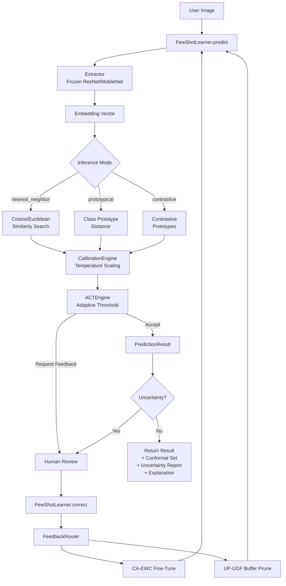

# AdaptShot Documentation

Created by Johnson Hassan.

AdaptShot is a CPU-first, human-in-the-loop few-shot vision learning library. This documentation covers the public APIs that exist in `src/adaptshot/`, plus runnable examples that measure latency and memory on your own machine.

This documentation tracks the v0.2.0 release. Use the native Python API as the source of truth; Studio is optional.

## How AdaptShot Works

The pipeline is a closed loop: every human correction feeds back into the learner, improving calibration, adjusting confidence thresholds, and fine-tuning the classification head while preserving prior knowledge.

## Start Here

- [Installation](getting-started/installation.md)
- [Quick Start](getting-started/quickstart.md)
- [Tutorial-Style Guides](tutorials.md)
- [Benchmarks](getting-started/benchmarks.md)

## API Reference

- [Core Engine](api/core.md)
- [Training & Continual Learning](api/training.md)
- [Configuration & Utilities](api/config.md)
- [Full API Reference (v0.2.0)](api/reference.md)

## Advanced Guides (v0.2.0)

- [Architecture Deep-Dive](guides/architecture-deep-dive.md)
- [Algorithm Theory](guides/algorithm-theory.md)
- [Studio Complete Guide](guides/studio-complete-guide.md)
- [UI Pilot Dashboard](guides/ui-pilot-guide.md)

## New Tutorials (v0.2.0)

- [Conformal Prediction](tutorials/14_conformal_prediction.md)
- [Advanced Uncertainty](tutorials/15_advanced_uncertainty.md)
- [Explainability & XAI](tutorials/16_explainability.md)
- [Contrastive Learning](tutorials/17_contrastive_learning.md)
- [End-to-End Workflow](tutorials/18_end_to_end_workflow.md)

!!! warning "Use The Source As Truth"
    If documentation and behavior differ, verify against `src/adaptshot/` and open an issue with the mismatch.

## Verification Checklist

- [ ] You can install `adaptshot`.
- [ ] You can run the quickstart script.
- [ ] You can run `python -m benchmarks.run_benchmark --smoke-test --seed 42` from a source checkout.
- [ ] You can trace each documented API to `src/adaptshot/`.
