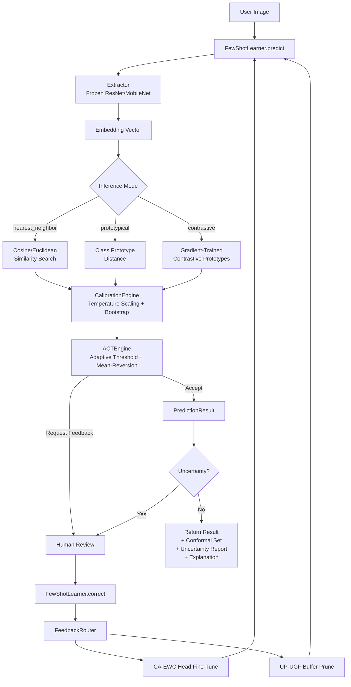

# AdaptShot Documentation

**Human-Aligned Few-Shot Vision Learning for Resource-Constrained Environments**

AdaptShot is a production-hardened, CPU-first few-shot vision library that learns from every human correction, guarantees calibrated uncertainty, and runs deterministically on edge hardware. Built in Tanzania by [Johnson Christopher Hassan](https://github.com/johnson2006christopher).

!!! success "v0.2.0 Production Hardened"
    92 regression tests, strict mypy type-checking, 0 ruff lint errors, 68% CIFAR-10 benchmark accuracy at 20ms latency. [Full changelog →](changelog.md)

---

## Feature Overview

| Category | Capability | Detail |
|----------|-----------|--------|
| 🧠 **Few-Shot Learning** | Prototypical, nearest-neighbor, and contrastive inference | 5-way 10-shot classification at 68%+ accuracy |
| 🔒 **Conformal Prediction** | True leave-one-out calibration | Distribution-free 95% coverage guarantee |
| 📊 **Uncertainty Quantification** | Epistemic · Aleatoric · Distributional (Mahalanobis) | Three complementary signals with shrinkage covariance |
| 🔍 **Explainability** | Feature attribution · Confidence decomposition · Counterfactuals | Historical penalty tracking, no magic numbers |
| 🔄 **Continual Learning** | Head-only CA-EWC fine-tuning · UP-UGF pruning with LSH acceleration | O(N log N) buffer management for >100 examples |
| ⚡ **CPU-First** | Numpy-based · <250MB RAM · 20ms P95 latency | No GPU required; PyTorch optional |
| 🤝 **Human-in-the-Loop** | ACT adaptive thresholds · Feedback routing · Bootstrap calibration | Symmetric threshold updates with mean-reversion |
| 🚀 **Production Ready** | ONNX export · Memory profiling · Deterministic seeding · SHA-256 checkpoints | Torch-free inference via bundled backbones |

---

## How AdaptShot Works

The pipeline is a closed loop: every human correction feeds back into the learner, improving calibration, adjusting confidence thresholds, and fine-tuning the classification head while preserving prior knowledge.

---

## Quick Links

### 🚀 Start Here
- [Installation](getting-started/installation.md) — Install in under 60 seconds
- [Quick Start](getting-started/quickstart.md) — First prediction in 5 minutes
- [Beginner 101](getting-started/beginner-101.md) — No AI experience required
- [Benchmarks](getting-started/benchmarks.md) — Run the smoke test on your machine

### 📚 Tutorial-Style Guides
- [Tutorial Index](tutorials.md) — 18 hands-on tutorials from basic to advanced
- [Conformal Prediction](tutorials/14_conformal_prediction.md) — Guaranteed coverage sets
- [Advanced Uncertainty](tutorials/15_advanced_uncertainty.md) — Multi-signal confidence
- [Explainability & XAI](tutorials/16_explainability.md) — Understand every prediction
- [Contrastive Learning](tutorials/17_contrastive_learning.md) — Gradient-trained prototypes
- [End-to-End Workflow](tutorials/18_end_to_end_workflow.md) — Full production pipeline
- [Memory Profiling](tutorials/13_profiling_memory.md) — Monitor RAM and latency
- [ONNX Deployment](tutorials/19_onnx_deployment.md) — Torch-free inference

### 📖 API Reference
- [Full API Reference (v0.2.0)](api/reference.md) — Every class, method, and data structure
- [Core Engine](api/core.md) — FewShotLearner, calibration, ACT, conformal
- [Training & Continual Learning](api/training.md) — CA-EWC, UP-UGF, FeedbackRouter
- [Configuration & Utilities](api/config.md) — AdaptShotConfig (27 fields), determinism, I/O

### 🧭 Advanced Guides
- [Architecture Deep-Dive](guides/architecture-deep-dive.md) — Module map and data flow
- [Algorithm Theory](guides/algorithm-theory.md) — Mathematical foundations
- [Real-World Use Cases](guides/real-world-use-cases.md) — Agriculture, healthcare, conservation
- [Human-in-the-Loop Deep Dive](guides/human-in-the-loop.md) — Feedback loop mechanics
- [Error Handling & Troubleshooting](guides/troubleshooting.md) — Common problems solved
- [Migration Guide (v0.1 → v0.2)](guides/migration-v0.1-to-v0.2.md) — Upgrade safely

### 🔧 Reference
- [Config Reference (All 27 Fields)](reference/config-reference.md) — Every parameter explained
- [Changelog](changelog.md) — Full release history
- [Contributing](contributing.md) — How to contribute
- [Code of Conduct](code_of_conduct.md)

---

## 🌍 Community & Support

-   :fontawesome-brands-github:{ .lg .middle } **Star & Fork on GitHub**

    ---

    [:star: Star the project](https://github.com/johnson2006christopher/adaptshot) to show your support and stay updated with new releases. Every star helps AdaptShot reach more people who need CPU-first AI.

-   :fontawesome-brands-whatsapp:{ .lg .middle } **Join the WhatsApp Community**

    ---

    [Join our WhatsApp group](https://chat.whatsapp.com/J6AbrvbjmBc5XXX2fnN6RK) for real-time discussion, help, and collaboration with fellow AdaptShot users and contributors worldwide.

-   :fontawesome-brands-github:{ .lg .middle } **Discussions & Ideas**

    ---

    [Start a GitHub Discussion](https://github.com/johnson2006christopher/adaptshot/discussions) to ask questions, propose features, or share how you're using AdaptShot in your community.

-   :material-hand-heart:{ .lg .middle } **Contribute**

    ---

    [Open a Pull Request](https://github.com/johnson2006christopher/adaptshot/pulls) or look for [good first issues](https://github.com/johnson2006christopher/adaptshot/issues?q=is%3Aissue+is%3Aopen+label%3A%22good+first+issue%22). Whether you write code, improve docs, or share your experience — every contribution matters.

---

!!! warning "Use The Source As Truth"
    If documentation and behavior differ, verify against `src/adaptshot/` and [open an issue](https://github.com/johnson2006christopher/adaptshot/issues) with the mismatch.

## Verification Checklist

- [ ] You can install `adaptshot`.
- [ ] You can run the quickstart script.
- [ ] You can run `python -m benchmarks.run_benchmark --smoke-test --seed 42` from a source checkout.
- [ ] You can trace each documented API to `src/adaptshot/`.
