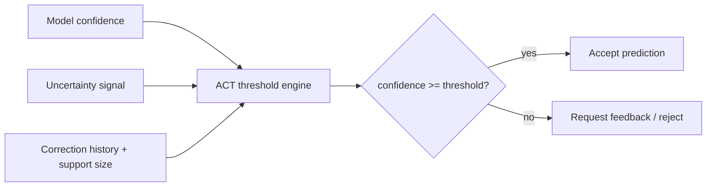

# Adaptive Confidence Thresholding (ACT) — Provisional Patent Draft

## Problem Statement
Few-shot models in low-data settings often produce overconfident false positives. Static confidence thresholds fail to adapt when uncertainty rises or correction patterns indicate unstable regions.

## Prior Art Gap
Conventional thresholding uses fixed cutoffs and ignores real-time evidence from correction history and support density. Existing calibration methods do not provide an operational decision policy that responds to changing human feedback signals.

## Novel Method
ACT computes a dynamic acceptance threshold:

\[
\tau_t = \text{clip}\left(\tau_0 + \alpha u_t + \beta c_t - \frac{\gamma}{1+s_t}, 0, 1\right)
\]

Where:
- \(\tau_0\): base threshold
- \(u_t\): uncertainty proxy (entropy/ECE-like)
- \(c_t\): correction rate for similar samples
- \(s_t\): support size for predicted class

Decision policy:
- Accept if confidence \(\ge \tau_t\)
- Request feedback if confidence is below \(\tau_t\)
- Reject outright if confidence is critically low

## Claims (Draft)
1. A method for uncertainty-aware few-shot classification comprising adaptive thresholding based on uncertainty, correction history, and support size.
2. The method of claim 1, wherein threshold monotonicity with uncertainty is enforced.
3. A system implementing the method of claim 1 on CPU-first inference pipelines with human-in-the-loop correction.

## Diagrams

## Implementation Notes
- CPU-first arithmetic only
- Deterministic clamping and rule ordering
- Designed to add negligible latency (<5ms overhead)
