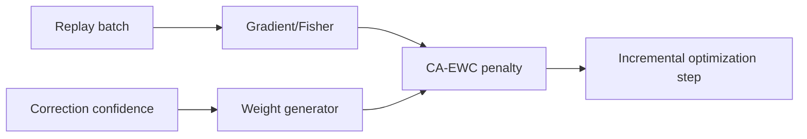

# Correction-Aware EWC (CA-EWC) — Provisional Patent Draft

## Problem Statement
Classical EWC preserves prior knowledge but treats all adaptation signals equally. In human-in-the-loop workflows, correction confidence varies, and fixed penalties either over-constrain learning or permit forgetting.

## Prior Art Gap
Standard EWC uses Fisher-weighted penalties without integrating confidence of human corrections. This ignores a high-value source of reliability for continual adaptation.

## Novel Method
CA-EWC augments EWC with correction-aware weighting:

\[
\mathcal{L}_{\text{CA-EWC}} = \lambda \sum_j w_j F_j(\theta_j - \theta_j^*)^2
\]

Where:
- \(F_j\): Fisher diagonal term
- \(\theta_j^*\): anchor parameter
- \(w_j\): correction-confidence-derived weight

Weighted Fisher estimation can also be applied per update batch.

## Claims (Draft)
1. A method for continual learning where EWC penalty strength is scaled by human correction confidence.
2. The method of claim 1, wherein Fisher estimates are batch-weighted by confidence metadata.
3. A system that uses confidence-aware regularization to reduce catastrophic forgetting under sparse supervision.

## Diagrams

## Implementation Notes
- Uses trainable head parameters by default for low-latency CPU updates
- Deterministic weighting bounds to avoid unstable gradients
- Compatible with replay-buffer incremental fine-tuning loops
