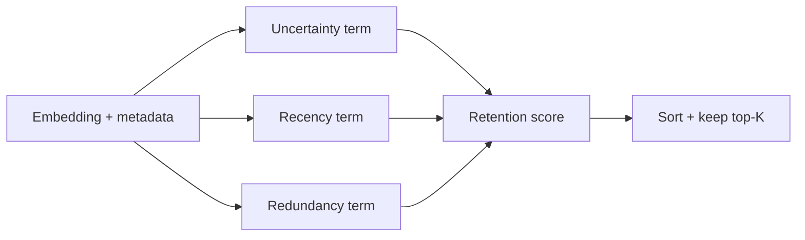

# Uncertainty-Guided Forgetting (UP-UGF) — Provisional Patent Draft

## Problem Statement
Replay buffers in continual few-shot learning grow quickly and degrade under redundant, stale, or high-uncertainty entries. Naive FIFO pruning discards potentially valuable examples.

## Prior Art Gap
Existing pruning methods commonly use only age or random eviction. They do not jointly model uncertainty quality, recency, and embedding redundancy.

## Novel Method
UP-UGF computes retention score:

\[
\text{score}_i = (1-\bar{u}_i)\cdot r_i \cdot (1-\rho_i)
\]

Where:
- \(\bar{u}_i\): mean uncertainty history
- \(r_i\): recency decay term
- \(\rho_i\): max redundancy against support embeddings

Lowest-score entries are pruned until capacity is met.

## Claims (Draft)
1. A memory-pruning method combining uncertainty, recency, and redundancy into a unified retention score.
2. The method of claim 1, wherein redundancy is computed by cosine similarity with threshold shaping.
3. A replay memory system that preserves adaptation quality under fixed memory budget constraints.

## Diagrams

## Implementation Notes
- CPU-safe NumPy scoring pipeline
- Deterministic sorting and selection
- Designed for low-overhead scoring before incremental updates
