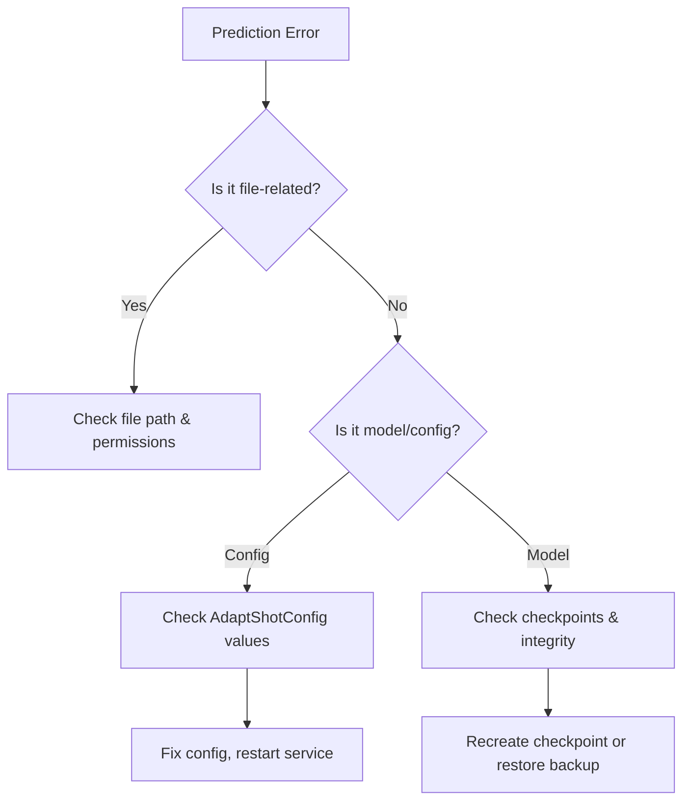

This guide assumes you completed the earlier tutorials and are working with AdaptShot v0.1.1. Focus: robustness, debugging, efficiency, and measuring energy.

**1. Handling Real-World Errors**

When calling AdaptShot APIs, handle runtime and validation exceptions from `src/adaptshot/utils/exceptions.py`:

- `AdaptShotError` (base class)
- `InvalidImageError` (image path/format/dimensionality problems)
- `ConfigValidationError` (bad configuration values)
- `CalibrationNotReadyError` (calibration window needs more examples)
- `BufferCapacityError` (buffer/pruning issues)

Use explicit try/except patterns so your service degrades gracefully. Example:

```python
from adaptshot.core.learner import FewShotLearner
from adaptshot.utils.exceptions import AdaptShotError, InvalidImageError, CalibrationNotReadyError

learner = FewShotLearner()
try:
    learner.load_support_images([], [])
except AdaptShotError as exc:
    # Print exact message shown by the library for diagnostics
    print("AdaptShotError:", str(exc))
except Exception as exc:
    print("Unexpected error:", exc)

# Typical exact messages you may see:
# "Support set cannot be empty. Provide at least one RGB image path and label. See docs/getting-started/quickstart.md."
# "Image file not found: '<path>'. Verify the path and try again."
# "Expected 3-channel RGB image, got <n>-channel mode '<mode>' from '<source>'. Convert before loading. See docs/getting-started/quickstart.md."
# Calibration-specific message template:
# "Calibration window is not ready. Need at least {min_samples} observations, got {observed}. Continue collecting feedback with correct()."
```

Table: Common exceptions and exact messages

| Exception | Example exact message (what you'll see) |
|---|---|
| `ConfigValidationError` | "n_way and k_shot must be positive integers." (from `src/adaptshot/config/settings.py`) |
| `InvalidImageError` | "Image file not found: '<path>'. Verify the path and try again." (see `_load_rgb_image_from_path` in `src/adaptshot/core/learner.py`) |
| `InvalidImageError` | "Expected 3-channel RGB image, got 1-channel grayscale array. Convert before loading. See docs/getting-started/quickstart.md." (see `_normalize_predict_image`) |
| `AdaptShotError` | "State file not found: '<path>'. Ensure the path is correct before loading." (see `FewShotLearner.load`) |
| `AdaptShotError` | "Checkpoint integrity check failed. The checkpoint may be corrupted or tampered with." (see `_load_state_payload`) |
| `CalibrationNotReadyError` | "Calibration window is not ready. Need at least {min_samples} observations, got {observed}. Continue collecting feedback with correct()." (see `_calibrate_or_raise`) |

**Try/Except patterns for production**

1. Validation errors (bad config or inputs): return HTTP 400 with the message.
2. Missing files or corrupted checkpoints: return HTTP 500 and alert operator; include exact message to logs.
3. Calibration not ready: accept predictions but flag for human review; surface message to UI so users can provide corrections.

Example: robust prediction endpoint (Flask-style, simplified)

```python
from flask import Flask, jsonify, request
from adaptshot.core.learner import FewShotLearner
from adaptshot.utils.exceptions import AdaptShotError

app = Flask(__name__)
learner = FewShotLearner()

@app.route('/predict', methods=['POST'])
def predict():
    try:
        image_path = request.json['path']
        res = learner.predict(image_path)
        return jsonify({'prediction': str(res.prediction), 'confidence': res.calibrated_confidence})
    except AdaptShotError as exc:
        app.logger.error(str(exc))
        return jsonify({'error': str(exc)}), 400
    except Exception as exc:
        app.logger.exception('Unhandled error')
        return jsonify({'error': 'internal server error'}), 500

# Expected errors in logs: exact strings from exceptions in the repo
```

---

**2. Optimizing for Low-Power Devices**

Key knobs in `src/adaptshot/config/settings.py`:

- `eco_mode` (bool): enable cheaper preview checks and early exits.
- `early_exit_threshold` (float): threshold between 0.5 and 1.0 (default 0.95) controlling early-exit aggressiveness.
- `backbone` ("resnet18" | "mobilenet_v3_small"): choose `mobilenet_v3_small` to reduce compute at some accuracy tradeoff.

Tradeoffs:

| Goal | Setting |
|---|---|
| Minimize energy & latency | `eco_mode=True`, `backbone="mobilenet_v3_small"`, lower `early_exit_threshold` (e.g., 0.9) |
| Maximize accuracy | `eco_mode=False`, `backbone="resnet18"`, keep `early_exit_threshold` high (0.98+) |

Runnable example: enable eco-mode and run the energy smoke test

```bash
python -m benchmarks.energy_profile --smoke-test --seed 42 --eco-mode --early-exit-threshold 0.9
# Expected: JSON printed with keys including "joules_estimate", "co2_g_estimate", "latency_avg_s", and "eco_mode": true
```

Notes:

- Default backbone is `resnet18`. Switch to `mobilenet_v3_small` in `AdaptShotConfig(backbone="mobilenet_v3_small")` for lower compute. See `src/adaptshot/config/settings.py`.
- `early_exit_threshold` must be within [0.5, 1.0] or `AdaptShotConfig.__post_init__` will raise: "early_exit_threshold must be within [0.5, 1.0]."

---

**3. Measuring Energy & Carbon**

Use `benchmarks/energy_profile.py` to run a deterministic smoke test and estimate energy and CO₂. Key output fields (exact keys in output JSON):

- `latency_avg_s` — average per-query latency (seconds)
- `latency_p95_s` — 95th percentile latency (seconds)
- `joules_estimate` — rough energy estimate (Joules)
- `co2_g_estimate` — estimated CO₂ equivalent (grams)
- `accuracy` — deterministic accuracy on synthetic data
- `eco_mode` — whether eco-mode was enabled

Run the smoke test (repository root):

```bash
python -m benchmarks.energy_profile --smoke-test --seed 42
# Output: printed JSON with baseline and eco variants and fields above
```

Interpreting results:

- Joules → energy consumed; high values mean more power draw. Use `joules_estimate` for rough comparisons across backbones and `eco_mode` settings.
- CO₂ → multiply by local grid intensity to estimate local footprint; the benchmark uses a conservative default. See `GRID_INTENSITY_CO2_PER_JOULE` in `benchmarks/energy_profile.py`.
- Optimize when energy per prediction matters (edge devices, battery-powered). Prioritize accuracy when errors are costly.

---

**4. Debugging Like a Pro**

Logging setup (recommended)

```python
import logging
logging.basicConfig(level=logging.INFO)
logger = logging.getLogger('adaptshot')
logger.setLevel(logging.DEBUG)  # in staging only
```

Symptoms → root cause → fix (table)

| Symptom | Likely root cause | Fix |
|---|---|---|
| `Image file not found` error | Wrong path or missing upload | Verify file path, permissions; log full path; return 400 to client |
| `Expected 3-channel RGB image` | Grayscale or wrong image format | Convert images to RGB before sending; validate on upload |
| `Support set cannot be empty` | Initialization order bug | Ensure `load_support_images()` is called before `predict()`; fail fast with 400 |
| `Checkpoint integrity check failed` | Corrupted or tampered checkpoint | Recreate checkpoint via `save()` or restore from backup; log checksum mismatch |
| Slow predictions / high latency | Using heavy backbone or high-resolution images | Switch to `mobilenet_v3_small`, enable `eco_mode`, or downscale images |

Mermaid troubleshooting flowchart (copy into MkDocs with mermaid enabled):



Determinism checks

- Use `src/adaptshot/utils/determinism.py` helpers called in `benchmarks/energy_profile.py` to verify deterministic behavior across runs. Determinism helps reproducible profiling.

---

**5. Deployment Checklist**

Use this checklist before rolling to production:

- [ ] Confirm `AdaptShotConfig(device='cpu')` and `torch` falls back to CPU.
- [ ] Set `max_buffer_size` to an appropriate value (>=10) to avoid `ValueError("max_buffer_size must be >= 10 for meaningful few-shot operation.")` from `AdaptShotConfig`.
- [ ] Validate checkpoint integrity: `FewShotLearner.load()` will raise: "Checkpoint integrity check failed. The checkpoint may be corrupted or tampered with." if mismatch.
- [ ] Run `benchmarks/energy_profile.py --smoke-test` and record `joules_estimate` and `co2_g_estimate`.
- [ ] Enable logging and monitor `adaptshot` logs for `AdaptShotError` occurrences.
- [ ] Add human-in-the-loop corrections in UI; ensure `learner.correct()` is reachable and `confidence_weight` is captured (0.0 -> 1.0).

Exact runtime checks (commands)

```bash
# Run smoke benchmark
python -m benchmarks.energy_profile --smoke-test --seed 42 --output results/energy_profile.json

# Quick import test
python -c "import sys, os; sys.path.insert(0, os.path.join(os.getcwd(),'src')); from adaptshot.core.learner import FewShotLearner; print('OK')"
```

---

**6. Best Practices Summary**

- Prefer `device='cpu'` and validate it in staging to match production constraints.
- Use `eco_mode` + `mobilenet_v3_small` for energy-sensitive deployments; measure impact with `benchmarks/energy_profile.py`.
- Surface clear error messages from `src/adaptshot/utils/exceptions.py` to users and logs.
- Keep checkpoints small and verify integrity at load time; automate backups.
- Add a simple human feedback loop to collect corrections — this improves calibration and reduces costly mistakes.

**7. Verification Checklist**

- [ ] My service catches and logs `AdaptShotError` subclasses and returns user-friendly errors.
- [ ] I can enable `eco_mode` and observe reduced `latency_avg_s` in the benchmark output.
- [ ] I can run `benchmarks/energy_profile.py --smoke-test` and read `joules_estimate` and `co2_g_estimate` from the results JSON.
- [ ] I can reproduce a `Checkpoint integrity check failed.` error by corrupting a checkpoint and seeing the exact message in logs.
- [ ] My deployment enforces `device='cpu'`, `max_buffer_size>=10`, and has a human correction route calling `learner.correct()`.
